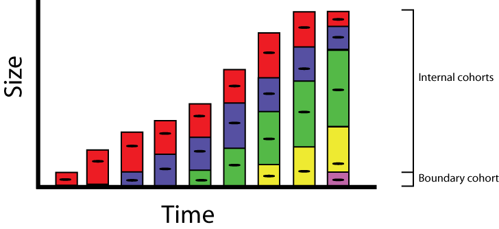

%  Ecological and evolutionary analysis of size-structured metapopulations using the escalator boxcar train

A system is physiologically or size structured whenever the basic rates of individuals (growth, mortality, reproduction) vary as functions of their size. These rates may also vary through environment, which can include feedbacks dependent on the current population state (e.g. density dependence).  Theory exists for tracing the development of a size- structured based on a partial differential equation (PDE) describing changes in the size distribution of individuals at any given time (describing the density function of individuals, rather than location of specific individuals). PSPs are formulated such that spatial distribution is neglected; only large populations are considered. Consequently the dynamics are entirely deterministic. These assumptions ensure similar individuals experience a homogeneous environment and are thus treated equally, and that inherently stochastic processes such as mortality can be reliably approximated by a deterministic description [makes use of the law of large numbers]. Individuals enter at the lower size class according to the rate of offspring production. The continuous nature of the system, with appropriate feedbacks, then ensures a dynamical solution to evolving size-structure including the problem of self-thinning. The dynamics of the population is given by the cumulative actions of its individuals.

# System dynamics

## Patch- and size-structured population dynamics

Consider a population living in a large area of habitat where:

- disturbances (such as fires, storms, landslides, floods, or disease outbreaks) strike patches of the habitat on a stochastic basis, killing individuals within affected patches;
- individuals compete for resources within patches, but the spatial scale of competitive interaction means interactions among individuals in adjacent patches are negligible;
- there is high connectivity via dispersal between all patches in the habitat, allowing empty patches to be quickly re-colonised.

Such a population is typically referred to as a metapopulation. Assuming pacthes are large, and there are many of them, the dynamics of this metapopulation can be captured deterministically using two PDEs (Kohyama 1993; deRoos 1997). Together these PDEs account for the combined influences of size-dependent variation in an individual's vital rates and disturbances on the size distribution of individuals. Below we outline equations suitable for modelling the equilibrium behaviour of such metapopulations.

The first PDE accounts for the effects of disturbances on the distribution of patch ages (defined as time since last disturbance) in the landscape (Von Foerster 1959; McKendrick 1926). 

Let $p(a)$  be the frequency-density of patches age $a$  and let $\gamma(a)$ be the age-dependent probability that a patch of age $a$ is transformed into a patch of age 0 by a disturbance event. Here we consider situations where the age structure has reached an equilibrium state, which causes the PDE to reduce to an ordinary differential equation (ODE) with respect to patch age. (see appendix about for [non-equilibrium case and derivation of PDE describing age-structured dynamics](#pdeDeriv-age)). The dynamics of $p$ are given by

\begin{equation} \frac{\partial}{\partial a} p(a)  = -\gamma(a) p(a) , \end{equation}
with boundary condition
\begin{equation}  p(0)  = \int_0^\infty \gamma(a) p(a) \; {\rm d} a. \end{equation}

This leads to a solution for the equilibrium distribution of patch-ages
\begin{equation} p(a) = p(0) \exp \left( \int_0^\infty \gamma(a^\prime) \; {\rm d} a^\prime \right),\end{equation}
where  
\begin{equation}
\frac1{p(0)} = \left( \int_0^\infty \exp \left( \int_0^{a^{\prime\prime}} - \gamma(a^\prime) \; {\rm d} a^\prime \right) d a^{\prime\prime} \right),\end{equation}
 corresponds to the average lifespan of a patch.

The second PDE accounts for the development of competitive hierarchies within patches recovering from a disturbance (Sinko \& Streifer 1967; Hara 1984; Metz \& Diekmann 1986; de Roos 1997). Here we consider cases where only newborns disperse between patches, and where disturbances remove all established individuals within a patch. Let $n(x,m,a)$ represent the density of individuals with traits $x$ and mass $m$ in a patch of age $a$. For sufficiently large populations, the dynamics of $n$ are then given by the PDE

\begin{equation} \label{eq:PDE} \frac{\partial }{\partial a} n(x,m,a)= -d(x,m, a) \; n(x,m,a)-\frac{\partial }{\partial m} \left[g(x,m,a) \; n(x,m,a)\right].  \end{equation}
For the derivation of this function see Appendix [derivation of PDE approximating size structured dynamics](#pdeDeriv-size). 

The functions $g(x,m,a)$, $d(x,m,a)$ and $f(x,m,a)$ are growth rate, death rate, and fecundity rate of individuals with traits $x$ and mass $m$ in a patch of age $a$. In principle, the arguments of these functions should be writing something like $g(x,m,E(x,\cdot,a))$, $d(x,m,E(x,\cdot,a))$ and $f(x,m,E(x,\cdot,a))$, where $E(x,\cdot,a)$ is the distribution of resources with respect to size $m$ in a patch age $a$ occupied by residents with traits $x$, and $E(x,m,a)$ gives the resources available to an individual of size $m$. To simplify notation throughout the remainder of the document we will drop the $E(x,\cdot,a)$ from $g, d,$ and $f$, and instead simply refer to patch age $a$, on the understanding by patch age $a$, we mean the structure of a patch age $a$ with given residents. 

Eq. $\ref{eq:PDE}$ has two boundary conditions. The first,

\begin{equation}  \label{eq:BC1} \frac{n(x,m_0,a)g(x,m_0 , a)}{\pi_1(x,m_0 ,a)} = \int_0^{\infty} p(a)  \int_0^{\infty}  \pi_0f(x,m,a) \; n(x,m,a)\,{\rm d} m \, {\rm d} a, \end{equation}

links the flux of newly arriving offspring across the lower bound $(m_0)$ of the size distribution within each patch (LHS), to the rate at which newly arriving offspring are produced in the metapopulation (RHS). The latter quantity, denoted $y_x$, serves as a useful measure for the abundance of the $x$ strategy. $\pi_0$  and $\pi_1$ give probabilities of offspring surviving dispersal and successfully establishing in a new patch, respectively. In this example we let $\pi_1$ be dependent on resource availability and $\pi_0$  be a constant.

The second boundary condition of Eq. $\ref{eq:PDE}$ gives the size distribution for patches immediately after a disturbance, $n\left(x,m,0\right)$. Since we are assuming disturbances remove all individuals within a patch,

\begin{equation} \label{eq:BC2} n\left(x,m,0\right) =0. \end{equation}

A convenient feature of Eqs. $\ref{eq:PDE}$ - $\ref{eq:BC2}$ is that the dynamics of a single patch scale up to give the dynamics of the entire metapopulation. The rate that offspring arrive from the disperser pool, $y_x$, is constant for a metapopulation at equilibrium. Combined with the assumption that all patches have the same initial (empty) size distribution, this feature ensures that all patches show the same temporal behaviour, the only difference between them being the ages at which they are disturbed. 

To model the temporal dynamics of an archetypal patch, we need only a value for $y_x$. The numerical challenge is therefore to find a value of $y_x$ that balances production and arrival of dispersers:

\begin{equation} \label{eq:solution} \int_0^\infty p(a) \int_0^\infty \pi_0 f(x,m,a) \; n(x,m,a) \, {\rm d} m \, {\rm d} a = y_x\end{equation}

Solving for $y_x$ is a straightforward one-dimensional root finding problem. Calculation of the LHS of Eq. $\ref{eq:solution}$, however, requires detailed information about $n(x,m,a)$, which in turn, requires a separate numerical method capable of solving the PDE in Eq. $\ref{eq:PDE}$.

## Invasion fitness

Let us now consider how we might estimate the fitness of a rare individual with trats $x^\prime$ growing in the environment of a resident community with traits $x$. We will focus on the phenotypic components of fitness -- i.e. the consequences of a given set of traits for growth, fecundity and mortality -- only, taking into account the non-linear effects of competition on individual success, but ignoring the underlying genetic basis for the trait determination. We also adhere to the standard conventions in such analyses by assuming that the resident population in large enough that a rare mutant has a negligible effect on the environment where it is growing. 

Invasion fitness is most correctly defined as the long-term per capita growth rate of a rare mutant population growing in the environment determined by the resident strategy (Metz et al. 1992). Calculating per-capita growth rates, however, can be particularly challenging in a structured metapopulation model (Gyllenberg \& Metz 2001; Metz \& Gyllenberg 2001). As an alternative measure of fitness, we can use the basic reproduction ratio, which gives the expected number of new dispersers arising from a single dispersal event, Evolutionary inferences made using the basic reproduction ratio will be similar to those made using per-capita growth rates for metapopulations at demographic equilibrium (Gyllenberg \& Metz 2001; Metz \& Gyllenberg 2001).

Let $R\left(x^\prime,x\right)$ be the basic reproduction ratio of individuals with traits $x^\prime$ growing in the competitive environment of the resident traits $x$. Recalling that patches of age $a$ have density $p(a)$ in the landscape, it follows that any seed of $x^\prime$ has probability $p(a)$ of landing in a patch age $a$. The basic reproduction ratio for individuals with traits $x^\prime$ is then:
\begin{equation} \label{eq:InvFit}
R\left(x^\prime,x\right)=\int _0^{\infty }p\left(a\right)\tilde{R}\left(x^\prime,a, \infty \right)\; {\rm d}a ,
\end{equation}
where $\tilde{R}\left(x^\prime,a_0,a \right)$ is the expected number of dispersing offspring produced by a single disperser arriving in a patch of age $a_0$ up until time $a$ (Gyllenberg \& Metz 2001; Metz \& Gyllenberg 2001). $\tilde{R}\left(x^\prime,a,\infty\right)$ is calculated by integrating an individual's fecundity over the expected lifetime the patch, taking into account competitive shading from residents with traits $x$, the individual's probability of surviving, and its traits:

\begin{equation} \label{eq:tildeR} \begin{array}{ll}\tilde{R}(x^\prime, a_0, a) =\pi_1 (x^\prime,m_0, a_0) \int_{a_0}^{a}  &\pi_0f(x^\prime, m(x^\prime, a_0, a^\prime), a^\prime)\times\\ \, &S_{\rm I} (x^\prime, a_0, a^\prime) \, S_{\rm P} (a_0,a^\prime)  {\rm d} a^\prime.\\\end{array}\end{equation}

Here,
\begin{equation} \label{eq:size} m(x^\prime, a_0, a) = m_0 + \int_{a_0}^{a} g(x^\prime, m(x^\prime, a_0, a^\prime),a^\prime) \, \rm{d}a^\prime \end{equation}

and 

\begin{equation} \label{eq:survivalIndividual} S_{\rm I} (x^\prime, a_0, a) = \exp\left(- \int_{a_0}^{a} d(x,m_i(x^\prime, a_0 ,a^\prime), a^\prime\right) \, {\rm d} a^\prime\end{equation}

are the size $m$ and survival $S_{\rm I} $ of dispersers that arrived in a patch of age $a_0$ at age $a$, while

\begin{equation} \label{eq:survivalPatch} S_{\rm P} (a_0,a) = \exp\left(-\int_{a_0}^{a} \gamma(a^\prime) \, {\rm d} a^\prime \right) \end{equation}
gives the probability that the patch remains undisturbed from $a_0$ to $a$. 

The notational complexity required for a general, non-linear solution might obscure an otherwise simple point: Eqs. $\ref{eq:size}$ - $\ref{eq:survivalPatch}$ are simply integrals of the growth and mortality functions, $\frac{{\rm d}}{{\rm d}a} m =g\left(x^\prime,m,a\right)$ and $\frac{{\rm d}}{{\rm d}a} S_{\rm I} =d\left(x^\prime,m,a\right) \; {\rm \; }S_{\rm I} $, with initial conditions $m\left(x^\prime,0,0\right)=m_0 $ and $S_{\rm I} \left(x^\prime,0,0\right)=1$.

## Emergent properties of resident community

Summary statistics of the metapopulation are obtained by integrating over the density distribution, weighting by patch abundance $p(a) $. Firstly, the total number of individuals in the metapopulation is given by
\begin{equation}\hat{n}(x) = \int_{0}^{\infty} \int_{0}^{\infty}p(a) \; n(x,m,a) \, {\rm d}a \, {\rm d}m,\end{equation}
and the average density of plants size $m$ by
\begin{equation}\bar{n}(x,m) = \int_{0}^{\infty}p(a) \; n(x,m,a) \, {\rm d}a.\end{equation}

Average values for other quantities can also be calculated. Let $\phi(x, m, a)$ be a demographic quantity of interest, such growth rate, mortality rate, light environment, or size. The average value of $\phi$ across the metapopulation is 
	\begin{equation}\hat{\phi}(x) = \frac1{\hat{n}(x) }\int_{0}^{\infty} \int_{0}^{\infty} p(a) \; n(x,m,a) \phi(x,m,a) \, {\rm d}a \, {\rm d}m,\end{equation}
while the average  value of $\phi$ for plants size $m$ is 
 \begin{equation}\bar{\phi}(x,m) = \frac1{\bar{n}(x,m) }\int_{0}^{\infty}p(a)  n(x,m,a) \phi(x,m,a)\, {\rm d}a.\end{equation}

 When calculating average mortality rate, a choice must be made as to whether mortality due patch disturbance is included. Non-disturbance mortality is obtained by setting $\phi(x,m, a) = d(x,m,a)$, while total mortality due to growth processes and disturbance is obtained by setting $\phi(x,m, a) = d(x,m,a)+ \gamma(a)\Phi(x).$)

(TODO: check this next section)
One might be interested in the frequency distribution of values as well as means. What we really want is the quartile function giving $Pr(\phi(m,a,t) < \phi_0)$.....rest commented out for now... <!-- The quartile function corresponds to the inverse of the cumulative distribution function. Even though we have a distn of $\phi$ wrt to $a$, I don't know whether this can be converted to a cdf. Therefore, use a resampling approach to obtain quartile. 
\begin{enumerate}
	\item Interpolate to get a distn of $p(a)  n(m,a,t)$ and $\phi(m,a,t)$ with respect to a (this step also needed for mean above) 
	\item Using Von Nueman Rejection Algorithm, randomly sample individuals from the probability distribution given by $f = p(a) \; n(m,a,t)$ [Generate 2D uniform numbers in range [$(0, max(f)), 0, max(a))$]. Using a spline fitted to true values of $a \& f$, estimate $f$ for the randomly generated $a$ values -> accept all samples where $f_{rand} < f_{spline}$]
	\item Use a spline to estimate $\phi$ for individuals accepted by rejection algorithm
	\item calculate quartiles empirically based on observed distns 
\end{enumerate} -->

# Approximating system dynamics using the escalator boxcar train (EBT)

The EBT solves the PDE describing development of $n(x,m,a)$ (Eq $\ref{eq:PDE}$)by approximating the density function by a collection of cohorts spanning the size spectrum (de Roos 1988, 1997). Following a disturbance, a series of cohorts are introduced into each patch. These cohorts are then transported along the characteristics of Eq $\ref{eq:PDE}$ according to the individual-level growth function. (Characteristics are curves along which Eq $\ref{eq:PDE}$  becomes an ordinary differential equation (ODE); biologically, these are the growth trajectories of individuals, provided they do not die). The numerical technique consists of approximating changes to the number of individuals within each cohort by a system of closed-form linear ODEs. Eq $\ref{eq:PDE}$ is thereby reduced to a family of ODEs, which can be stepped using an appropriate ODE solver with an adaptive step size (Press 1995).

Below we consider two alternative implementations of the EBT. Both require that we introduce a series of cohorts into a patch, and that these be transported along the characterstics of the Eq $\ref{eq:PDE}$ (figure).

Let $\Omega = \left[m_0,m_+ \right) $ represent the entire state-space attainable by any individual and let the interior of $\Omega $ be subdivided into $k$ sub-domains  $\Omega_i(a) = \left[m_{i=1}(a),m_i(a) \right) $ , with $i=1,\dots, k$ and $m_0 < m_1<	\ldots<m_k = m_+$. If we allow these sub-domains to be transported through time along the characteristics of Eq $\ref{eq:PDE}$ , they will be closed to transport processes across their upper and lower boundaries.

## Approximation based on modelling of cohort boundaries

In the EBT, the cohort (or sub-domain) boundaries are defined by a series of time points where one cohort is ended, and another is initialised. As the patch ages, the width of all cohorts varies, as they are transported up along the size spectrum (see figure). It is helpful to think of these boundaries as representing individual that germinated exactly at the patch age defining the cohort boundary. The growth trajectory of that individual then defines the trajectory of the cohort boundary.   

In the derivation of the original EBT, equations were given for tracking the size of cohort boundaries, but these were not essential for the numerical approximation of systems dynamics. However, it is possible to approximate the entire system by only following the cohort boundaries.  

### Size

*Definition:* $m_i(x, a_0, a) = m_0 + \int_{a_0}^{a} g(x,m_i(x, a_0, a^\prime),a^\prime) \, \rm{d}a^\prime$

*Numerical technique:* Step with ODE stepper.

### Survival

*Definition:* $S_{\rm I} (x, a_0, a) = \exp\left(- \int_{a_0}^{a} d(x,m_i(x, a_0 ,a^\prime), a^\prime\right) \, {\rm d} a^\prime.$

*Numerical technique:* Calculate integral within brackets with ODE stepper.

### Density of individuals

Obtained by [integrating along characteristics - see Appendix](#IntegrationAlongCharacteristics)

*Definition:*
\begin{equation} \begin{array}{ll}  n(x, m, a) & =n(x,m_0 ,a_0) \times \\
& \exp \left(-\int _{a_0}^{a} \left[\frac{\partial g(x,m(x, a_0, a^\prime),a^\prime)}{\partial m} +d(x,m(x, a_0, a^\prime),a^\prime)\right] {\rm d}a^\prime \right)\end{array} \end{equation}

where
\begin{equation} n(x,m_0 ,a_0)  = \left\{ \begin{array}{ll}   \frac{y_x}{ g(x,m_0, a_0) }  & \textrm{if } g(x,m_0, a_0) \geq 0 \\
0 & \textrm{otherwise.}  \end{array} \right. \end{equation}

*Numerical technique:* Calculate integral within brackets with ODE stepper and combine with $n(x,m_0 ,a_0)$, which is calculated when the individual is first introduced.

### Seed production

*Definition:*  Let $\tilde{R}(x, a_0, a)$ be the number of offspring produced by an individual arriving in a patch of age $a_0$ up to time $a$. Then $\tilde{R}(x, a_0, s)$ is
\begin{equation}\begin{array}{ll}\tilde{R}(x, a_0, a) =\pi_1 (x,m_0, a_0) \int_{a_0}^{a}  &\pi_0f(x, m(x, a_0, a^\prime), a^\prime)\times\\ \, &S_{\rm I} (x, a_0, a^\prime) \, S_{\rm P} (a_0,a^\prime)  {\rm d} a^\prime,\\\end{array}\end{equation}
where $S_{\rm I} $ is individual survival (defined above) and
$S_{\rm P} (a_0,a) = \exp\left(-\int_{a_0}^{a} \gamma(a^\prime) \, {\rm d} a^\prime \right)$ is the probability of a patch remaining undisturbed to this point.

To scale up seed production for the metapopulation need to integrate across all possible seed-arrival times:
\begin{equation} R(x) = \int_0^{\infty}  p(a) \, \tilde{R}(x, a,  \infty) \, {\rm d}a. \end{equation}

(TODO: Align this equation with earlier one. )

## Approximating dynamics of internal cohorts 

The original EBT, derived by de Roos (1997, 1988), proceeded by approximating what . 
The first and second moments of the density distribution $n \left( x,m,a \right) $ within each sub-domain, represented by $\lambda_i$ and $\mu_i$, give the total number and mean size of individuals within $\Omega_i$ respectively. 

Under this assumption, the rates of change $\frac{\rm d} {{\rm d}a} \lambda_i$ and $\frac{\rm d} {{\rm d}a} \mu_i$ can be approximated given by two ODEs, which can be approximated by first-order closed-form solutions. These approximations form the centrepiece of the EBT, and are derived as follows.

Substituting $\phi $ for the appropriate combinations of growth and mortality functions leads to the approximations for $\frac{\rm d} {{\rm d} a} \lambda_i$ and $\frac{\rm d} {{\rm d}a} \mu_i$ given below.  [methods in appendix](#DeriveEBTapproximation).

### First moment: Number of individuals

*Definition:*
\begin{equation}  \lambda_i = \int_{\Omega_i} n(x,m,a) \; {\rm d}m \end{equation}

\begin{equation} \frac{{\rm d} }{{\rm d}a} \lambda_i = -\int_{\Omega_i} d(x,m,E) \; n(x,m,a) \; {\rm d}m \end{equation}

*Numerical technique:* The rate of change in $\lambda_i $ is approximated by
$\frac{{\rm d} }{{\rm d}a} \lambda_i =  d(x,\mu_i,E) \lambda_i $, and $\lambda_i $ estimated by integrating this quantity with an ODE stepper.

### Second moment: Average size

*Definition:*
\begin{equation}  \mu_i = \frac1{\lambda_i}\int_{\Omega_i} m \; n(x,m,a) \; {\rm d}m  \end{equation}

\begin{equation} \frac{{\rm d} }{{\rm d}a} \mu_i = \frac1{\lambda_i} \int_{\Omega_i} \left[ g(x,m,E) - ( m-\mu_i ) d(x,m,a) \right] n(x,m,a) \; {\rm d}m  \end{equation}

*Numerical technique:* The rate of change in $\mu_i$ is approximated by
\begin{equation}  \frac{{\rm d} }{{\rm d}a} \mu_i =  g(x,\mu_i,E), \end{equation}

with $\mu_i$ estimated by integrating this quantity with an ODE stepper

### Density of individuals

*Definition:* $n(x,m,a) $ for $m \in \Omega_i$

*Numerical technique:* see section above.

The EBT technique solves the PDE by approximating the changing size distribution $n(x,m,a)$ with a series of point masses with position and amplitude given by $\lambda_i$ and $\mu_i$. If we let $\delta(z)$ be a function for a point mass of size 1 localised at $z=0$, then

\begin{equation} n(x,m,a) \approx = \sum_{i=1}^{k} \lambda_i(a) \; \delta(m-\mu_i(a)). \end{equation}

The density function $n(x,m,a$ within each sub-domain can also be estimated from its first moment using a discontinuous, piecewise-linear function:

\begin{equation} n_i \left( x,m,a \right) \approx \frac{\lambda_i}{m_i-m_{i-1}} . \end{equation}

[$(i =2,\dots .,k)$]
### Seed production

(needs work)

*Definition:*  Let $\tilde{R}(x, a_1, a_2, a)$ be the number of offspring produced up to age $a$ by individuals within a cohort born between $a_1$ and $a_2$. Then
\begin{equation} \tilde{R}(x, a_1, a_2, a) = \int_{a_1}^{a}  f(x, mu(x, a^\prime), a^\prime) \lambda(x, a^\prime) \; {\rm d}a^\prime  \end{equation}
(TODO: This is approximation. Exact is double integral. Where is patch survival?)

To scale up seed production for the metapopulation need to integrate across all possible seed-arrival times:

\begin{equation} R(x) = \int_0^{\infty}  p(a) \, \tilde{R}(x, a, \infty) \, {\rm d}a. \end{equation}

(TODO: Align this equation with earlier one. )

## Approximating dynamics of the boundary cohort

A slightly modified set of equations is needed to track the moments of the smallest cohort, whose lower bound is fixed at $m_0 $. Specifically, a new quantity$\Pi $, representing the total accumulated mass within this boundary cohort, is monitored in place of the second moment, which would otherwise be undefined whenever $\lambda _i=0$. Our approximations for the boundary cohort differ slightly to those of de Roos (1997, 1988) in that we Taylor expand around the centre of mass for the cohort instead of the lower boundary. Because relative growth rates often decline quickly with increasing size, use of lower boundary can overestimate the growth rate of the cohort.

### Number of individuals

*Definition:*
\begin{equation} \lambda_1 = \int_{\Omega_1} n(x,m,a) \; {\rm d}m \end{equation}

\begin{equation} \frac{{\rm d} }{{\rm d}a} \lambda_1 = y_x \pi_0 \pi_1(x,m_0, a) - \int_{\Omega_1} d(x,m,a) \; n(x,m,a) \; {\rm d}m  \end{equation}

(TODO: I $\pi_0$ in right place here? Should appear in seed production, not inflow).
*Numerical technique:* $\frac{{\rm d} }{{\rm d}a} \lambda_1 = y_x - d(x,\mu_1,a) \lambda_1 $

### new biomass

*Definition:* $\Pi_1 = \int_{\Omega_1} (m-m_0) \; n(x,m,a) \; {\rm d}m $

*Exact:* $\frac{{\rm d} }{{\rm d}a} \Pi_1 = \int_{\Omega_1} \left[ g(x,m,E) - ( m-\mu0) d(x,m,a) \right] n(x,m,a) \; {\rm d}m  $

*Numerical technique:* $\frac{{\rm d} }{{\rm d}a} \Pi_1 =
 g(x,\mu_1,a) \lambda_1 - \Pi_1  d(x,\mu_1,a)$

### Average size

*Definition:*
\begin{equation}  \mu_1 = \left\{ \begin{array}{ll} \frac1{\lambda_i}\int_{\Omega_i} m \; n(x,m,a) \; {\rm d}m   & \textrm{if } \lambda_1 > 0 \\
m_0 & \textrm{otherwise}  \end{array} \right. \end{equation}

\begin{equation} \mu_1 = \left\{ \begin{array}{ll}  m_0 + \frac{\Pi_1}{\lambda_1}  & \textrm{if } \lambda_1 > 0 \\
m_0 & \textrm{otherwise}  \end{array} \right. \end{equation}

*Numerical technique:* NA, use exact.

## Integration techniques
( To review  - converting integrals to ODEs)

See Apepndix - expressing any integral as ODE IVP problem. 

Integration of seed production over the boundary cohorts and over photosynthesis is over leaf area is achieved using the trapezoidal rule:
\begin{equation}\int_{x_1}^{x_{n}}f(x)dx \approx 0.5 \sum_{i=0}^{i=N-1} \bigg[ \left(f(x_{i}) + f(x_{i+1})\right)\left( x_{i+1}- x_{i}\right)\bigg].\end{equation}
For regularly spaced intervals we have the simplified version 
\begin{equation}\int_{x_1}^{x_{n}}f(x)dx \approx \Delta x \bigg[0.5 f_{0}+f_2+\ldots+ f_{N-1}+0.5 f_{N}\bigg] .\end{equation} 

Total photosynthesis is calculated by integrating assimilation over the leaf area of the plant using the simplified trapezoidal rule for regularly spaced intervals. The formula for total photosynthesis for a plant size $m$ as described in the model is given by 
\begin{equation} \frac{m}{\phi}  \int_{0}^{h(m)}A(I(z)) \, l\left(\frac{z}{h(m)}\right) \, dz,\end{equation}
where $x\in [0,1]$ is the relative height in the canopy (1 gives top) and $l(x)$ is the density of leaf area at height $x$. However, rather than integrating this function directly, we can reformulate it to give an integral directly over leaf area, so that computational effort is spent on resolving changes in light availability with height, rather than resolving the shape of the leaf area distribution itself. To achieve this we require the integral of $l(x)$: $L(x) = 1-x^{\eta}(2-x^{\eta})$ for $0\leq x\leq1$,  which gives the cumulative fraction of leaf area above height $x$, and its inverse function,  $L^{-1}(u) = (1-\sqrt{u})^{\frac1{\eta}}$, which gives the relative height $x$ which has a fraction $u$ of total leaf area above it. Substituting into the above integral for total photosynthesis, we obtain 
\begin{equation} \frac{m}{\phi}  \int_{0}^1A\big(I(h(m)L^{-1}(u))\big) \, du.\end{equation}

## Environment feedback

is calculated by integrating a function $\Phi \left(m',m\right)$, giving the competitive effect of individuals size $m'$ on the resources available to the focal individual of size$m$, over the size distribution:

## controlling error in EBT

Errors in the EBT approximation to $n$ can arise from two sources: (i) poor spacing of cohorts in the size dimension, and (ii) when stepping cohorts through time. Error of the latter type is effectively controlled using a suitable ODE solver and is not considered further here. However, there is no existing method to control error arising from poor spacing of cohorts. Poor cohort spacing introduces error both because the equations governing cohort dynamics are only accurate up to second order (Table 4-1), and because any integrals over the size distribution (e.g. total offspring production, competitive effect) may be poorly resolved.

[See derivations in appendix](#EBTerrorEstimate)

# Appendices

## Derivation of PDE describing age-structured dynamics {#pdeDeriv-age}

Consider patches of habitat which are subject to some intermittent disturbance and where the age of a patch is corresponds to the time since the last disturbance. Let $p(a,t)$ be the frequency-density of patches age $a$ at time $t$ and let $\gamma(a)$ be the age-dependent probability that a patch of age $a$ is transformed into a patch of age $0$ through disturbance. Then according to the Von Foerster equation for age-structured population dynamics (von_foerster_remarks_1959), the dynamics of $p(a,t)$ are given by 
$$ \frac{\partial }{\partial t} p(a,t)=-\frac{\partial }{\partial a} p(a,t)-\gamma(a,t)p(a,t),$$ 
with boundary condition
$$ p(0,t)=\int^{\infty}_{0}\gamma(a,t)p(a,t)\,{\rm d}a.$$ 

The frequency of patches with $a < x$ is given by $\int_{0}^{x}p(a,t) \, {\rm d}a$, with $\int_{0}^{\infty} p(a,t) \, {\rm d}a =1$. If $\frac{\partial}{\partial t}\gamma(a,t)=0$, then $p(a)$ will approach an equilibrium solution given by
$$p(a) = p(0) \Pi(a),$$
where
$$\Pi(a) = \exp \left( \int_{0}^{a}-\gamma(\tau)\,{\rm d}\tau\right)$$
is the probability that a local population will remain undisturbed for at least $a$ years (patch survival function), 
and 
$$p(0) = \frac1{ \int_{0}^{\infty}\Pi(a) \,{\rm d}a}$$ 
is the frequency-density of patches age 0. The rate of disturbance for patches age $a$ is given by $\frac{\partial (1-\Pi(a))}{\partial a} = \frac{-\partial \Pi(a)}{\partial a}$,
 while the expected lifetime for patches is $\int_0^\infty - a \frac{\partial}{\partial a} \Pi(a) \, {\rm d} a = \int_0^\infty \Pi(a) \, {\rm d} a = \frac1{p(0)}$ (2$^{nd}$ step made using integration by parts). 

An equilibrium patch age distribution may be achieved under a variety of conditions, for example if $\gamma(a,t)$ depends on patch age but the this probability is constant over time. The probability of disturbance may also depend on features of the vegetation (rather than age *per se*), in which case  an equilibrium is still possible, provided the vegetation is also assumed to be at equilibrium. 

### Exponential distribution
If the probability of patch disturbance is constant with respect to patch age ($=\lambda$), then rates at which patches age $a$ are disturbed follow an exponential distribution: $-\partial \Pi(a)/ \partial a = \lambda e^{-\lambda a}$. The patch age distribution is then given by:
$$ \Pi(a) = \exp\left(-\lambda a\right), p(0) = \lambda.$$

### Weibull distribution
If the probability of patch disturbance changes as a function of time, with $\gamma(a) = \lambda \psi  a^{\psi-1}$, then rates at which patches age $a$ are disturbed follow a Weibull distribution: $-\partial \Pi(a)/ \partial a = \lambda \psi a^{\psi -1}e^{-\lambda a^\psi}$. Values of $\psi>1$ imply probability of disturbance increases with patch age; $\psi<1$ implies probability of disturbance decreases with age. When $\psi=1$ we obtain the exponential distribution, a special case of the Weibull. The Weibull distribution results in following for the patch age distribution:
$$\Pi(a) = e^{-\lambda a^\psi}, p(0) =  \frac{\psi \lambda^{\frac1{\psi}}}{\Gamma\left(\frac1{\psi}\right)},$$ 
where $\Gamma(x)$ is the gamma function $\left(\Gamma(x) = \int_{0}^{\infty}e^{-t}t^{x-1}\, dt\right)$. We can also specify the distribution by its mean return time $\bar{a}  = \frac1{p(0)}$.  Then, calculate relevant value for $\lambda =  \left(\frac{\Gamma\left(\frac1{\psi}\right)}{\psi \bar{a}}\right)^{\psi}$. 

### Variable distributions
The probability of patch disturbance might also be vary with properties of the vegetation. In this case, we cannot prescribe a known distribution to $p(a)$, it must be solved numerically. Patch survival can be calculated numerically as 
$$\Pi(a) = \exp \left( \int_{0}^{a}-\gamma(\tau)\,{\rm d}\tau\right).$$
For calculations of fitness, we want to integrate over some fraction $q$ of the patch age distribution (i.e. ignoring the long tail of the distributions). Thus we want to find the point  $x$ which satisfies $\int_{0}^{x} p(a)\,{\rm d}a =q$.Locating $x$ requires knowledge of $p(0)$, which in turn requires us to approximate the tail of the integral  $\int_{0}^{\infty} \Pi(a)\,{\rm d}a$. For $a > x$, let $\Pi(a)$ be approximated by 
$$\Pi(a) \approx \Pi(x) \exp\left( - (x-a) \gamma(x)\right).$$ Then  
$$p(0)^{-1} =\int_{0}^{\infty} \Pi(a)\,{\rm d}a \approx \int_{0}^{x} \Pi(a)\,{\rm d}a + \int_{x}^{\infty } \Pi(a)\,{\rm d}a$$
$$ = \int_{0}^{x} \Pi(a)\,{\rm d}a + \frac{\Pi(x)}{\gamma(x)}. $$
Substituting into $\int_{0}^{x} p(a)\,{\rm d}a =q$, we obtain 
$$q=  p(0) \int_{0}^{x} \Pi(a) \, {\rm d}a = \frac{\int_{0}^{x} \Pi(a) \, {\rm d}a}{\int_{0}^{x} \Pi(a)\,{\rm d}a + \frac{\Pi(x)}{\gamma(x)}}$$
$$\Rightarrow  \frac{\Pi(x)}{\gamma(x)} = \frac{1-q}{q} \int_{0}^{x} \Pi(a) \, {\rm d}a.$$
Thus by monitoring $\Pi(x), \gamma(x),  \int_{0}^{x} \Pi(a) \, {\rm d}a$ we can evaluate when a sufficient range of the patch age distribution has been incorporated.

## Derivation of PDE describing size-structured dynamics {#pdeDeriv-size}

For general notes on structured population and analysis of data see (Metz and Diekmann 1986, Taljapurkar and Caswell 1997, Diekmann et al. 1998, Diekmann et al. 2001)

### 1-dimensional case

To model the population we use a PDE describing the dynamics for a thin slice $\Delta m$. Assuming that all rates are constant within the interval $\Delta m$, the total number of individuals within the interval spanned by $[m-0.5\Delta m,m+0.5\Delta m)$ is $n(m,a)\Delta m$ . The flux of individuals in and out of the size class can be expressed as
\begin{equation}\begin{array}{ll} J(m,a)=&g(m-0.5 \Delta m,a) \; n(m-0.5 \Delta m,a)-g(m+0.5 \Delta m,a) \; n(m+0.5 \Delta m,a) \\ &-d (m,a) \; n(m,a)\Delta m\\ \end{array}.\end{equation}
The first two terms describe the flux in and out of the size class through growth; the last term describes lossed due through mortality. The change in number of individuals within the interval across a time step \textit{$\Delta $t} is thus:
\begin{equation}\begin{array}{ll} n(m,a+\Delta a)\Delta m-n(m,a)\Delta m= &g(m-0.5 \Delta m,a) \; n(m-0.5 \Delta m,a)\Delta a \\ &-g(m+0.5 \Delta m,a) \; n(m+0.5 \Delta m,a)\Delta a\\&-d (m,a) \; n(m,a)\Delta m\Delta a. \end{array}\end{equation} 
Rearranging,
\begin{equation}\begin{array}{ll} \frac{n(m,a+\Delta a)-n(m,a)}{\Delta a} = &-d (m,a) \; n(m,a) \\
&-\frac{g(m+0.5 \Delta m,a) \; n(m+0.5 \Delta m,a)-g(m-0.5 \Delta m,a) \; n(m-0.5 \Delta m,a)}{\Delta m}.\end{array}\end{equation}
The LHS is corresponds to the derivative of $n$ as $\Delta a\to 0$. For thin slices, $\Delta m\sim 0$, we obtain 
\begin{equation} \label{eq:PDE-app}
\frac{\partial }{\partial t} n(m,a)=-d (m,a) \; n(m,a)-\frac{\partial }{\partial m} (g(m,a) \; n(m,a)).
\end{equation}

To complete the model, the PDE must be supplemented with boundary conditions that specify the density at the lower end of $n(m_{0},a)$ for all $t$ as well as the the initial distribution when $t=0$, $n(m,0)$.  The former is derived by integrating the PDE with respect to $m$ over the interval $(m_{0},m_{\infty })$, yielding 

\begin{equation}\frac{\partial }{\partial t} \int _{m_{0} }^{m_{\infty } }n(m,a) \partial m=g(m_{0} ,a) \; n(m_{0} ,a)-g(m_{\infty } ,a) \; n(m_{\infty } ,a)-\int _{m_{0} }^{m_{\infty } }d (m,a) \; n(m,a) \partial m.\end{equation} 

The LHS of this relationship is evidently the rate of change of total numbers of individual in the population, while the right-hand-term is the total population death rate. Further, $n(m_{\infty } ,a)=0$. Thus to balance total births and deaths, $g(m_{0} ,a) \; n(m_{0} ,a)$ must equal the birth rate $B(x, n, E,a)$. Thus the boundary condition is given by
\begin{equation}g(m_{0} ,a) \; n(m_{0} ,a)=B(x, n, E,a).\end{equation} 

### Extension to a population structured by 2 size-dimensions

If there is more than one dimension in the i-state, then a corresponding PDE can be derived. Consider a system where individuals have two state dimensions: $m_1,m_2$. Then the total number of individuals in the bin spanned by intervals $[m_1-\Delta m_1,m_1+\Delta m_1)$,  $[m_2-\Delta m_2,m_2+\Delta m_2)$ is $n(m_1,m_2,a)\Delta m_1, \Delta m_2$ . The flux of individuals in and out of the size class can be expressed as
\begin{equation}\begin{array}{ll} J(m_1,m_2,a)=
&+g(m_1-0.5 \Delta m_1,m_2,a) \; n(m_1-0.5 \Delta m_1,m_2,a)\Delta m_2\\
&-g(m_1+0.5 \Delta m_1,m_2,a) \; n(m_1+0.5 \Delta m_1,m_2,a)\Delta m_2 \\ 
&+g(m_1,m_2-0.5 \Delta m_2,a) \; n(m_1,m_2-0.5 \Delta m_2,a)\Delta m_1\\
&-g(m_1,m_2+0.5 \Delta m_2,a) \; n(m_1,m_2+0.5 \Delta m_2,a)\Delta m_1 \\ 
&-d(m_1,m_2,a) \; n(m_1,m_2,a)\Delta m_1 \Delta m_2. \end{array}\end{equation}
The change in number of individuals within the interval across a time step \textit{$\Delta $t} is then:
\begin{equation}\begin{array}{ll} n(m_1,m_2,a+\Delta a)\Delta m_1\Delta m_2&-n(m_1,m_2,a)\Delta m_1\Delta m_2=\\
&+g(m_1-0.5 \Delta m_1,m_2,a) \; n(m_1-0.5 \Delta m_1,m_2,a)\Delta m_2 \Delta a\\
&-g(m_1+0.5 \Delta m_1,m_2,a) \; n(m_1+0.5 \Delta m_1,m_2,a)\Delta m_2 \Delta a \\ 
&+g(m_1,m_2-0.5 \Delta m_2,a) \; n(m_1,m_2-0.5 \Delta m_2,a)\Delta m_1 \Delta a\\
&-g(m_1,m_2+0.5 \Delta m_2,a) \; n(m_1,m_2+0.5 \Delta m_2,a)\Delta m_1 \Delta a\\ 
&-d(m_1,m_2,a) \; n(m_1,m_2,a)\Delta m_1 \Delta m_2 \Delta a. \end{array}\end{equation} 

Rearranging and taking the limits as $\Delta a, \Delta m_1, \Delta m_2 \to 0$ yields the PDE for the 2D system
\begin{equation}\begin{array}{ll} \frac{\partial }{\partial t} n(m_1,m_2,a)=&-\frac{\partial }{\partial m_1} (g(m_1,m_2,a) \; n(m_1,m_2,a)) -\frac{\partial }{\partial m_2} (g(m_1,m_2,a) \; n(m_1,m_2,a)) 
\\&-d (m_1,m_2,a) \; n(m_1,m_2,a).\end{array}\end{equation} 

## Exact solutions: Integration along characteristics {#IntegrationAlongCharacteristics}

Characteristics are the projections of an individual's trajectory in i-space and time, provided they do not die. By integrating along characteristics, the PDE can be solved to yield the a general solution for the density of individuals with time of birth $t_{b} > 0$:
\begin{equation}\label{eq:n1}
n(m,t)=n(m_0 , t_b) \exp \bigg(-\int _{t_b}^{t} \left[\frac{\partial g(m(\theta ),E(\theta ))}{\partial m} +d(m(\theta ),E(\theta ))\right] d\theta \bigg)
\end{equation}
 
This states that the density $n$ at a specific time is a product of density at the origin adjusted for changes through development and mortality. Using the second boundary condition above, $n(m_{0} ,t_{g})$ can be replaced by $B(x, n, E,t_{b}) / g(m_{0} ,E(t_{b}))$. Note that density decreases through time because of mortality (as per typical survival equation), but that growth also contributes to changes in density. If growth is slowing with size, (i.e. $\frac{\partial g(m(\theta ),E(\theta ))}{\partial m}  <0$), then density increases because the characteristics converge on one another. Eq \ref{eq:n1} can be solved (numerically or analytically) to give density with full ecological feedback and in changing environemnts. \\

In cases where the environment is constant and time-independent ($E(t)=E_c$), it is possible to further simplify eq \ref{eq:n1} to give (see \cite{de_roos_gentle_1997} page 153 for proof):

\begin{equation}\label{eq:n2}
n(m,t)=\frac{B(x, n, E_c,t_{b})}{g(m,E_{c} )} \exp \bigg(-\int _{m_{b} }^{m}\frac{d(\xi ,E_{c} )}{g(\xi ,E_{c} )}  d\xi \bigg). \end{equation}

Equation \ref{eq:n2} can be used to obtain in cases where environment is constant, either externally imposed in which case an analytic solution may be possible or when eq \ref{eq:PDE-app} is at equilibrium $\bigg(\frac{\partial n(m, t)}{\partial t} =0\bigg)$. It is necessary to know the origin of the characteristic for individuals of size $m$ at time $t$ to model their density. 

To this end, it is useful to specify a function $\tau(m ,m_{b}, Ec )$ for the age of an individual of size $m$ such that $t_{b} =t-\tau (m,m_{b} ,E_{c} )$.  Note also, $\exp \bigg(-\int _{m_{b} }^{m}\frac{d(\xi ,E_{c} )}{g(\xi ,E_{c} )}  d\xi \bigg)$ is equal to the overall survival to size $m$, i.e.
\begin{equation}S(m(t))= \exp \bigg(-\int _{m_{b} }^{m}\frac{d(\xi ,E_{c} )}{g(\xi ,E_{c} )}  d\xi \bigg) = \exp \bigg(-\int _{t_{b} }^{t}d(m(\tau) ,E_{c} ) \; {\rm d}\tau \bigg).\end{equation}

Using equation \ref{eq:n2} it is also possible to show that in populations at demographic equilibrium and without disturbance, the lifetime seed output of an average individual should be 1.0.  The seed rain for a community is given by 
\begin{equation}R = \int_{m_{b}}^{m_{max}} f(m, E_{c}) \; n(m)\, dm.\end{equation}
Substituting from above we have
\begin{equation}R =  B(x, n, E_c,t_{b})  \int_{m_{b}}^{m_{max}} \frac{f(m, E_{c})}{g(m,E_{c} )} S(m) \, dm.\end{equation}
Note that $m(t) = m_{0} + \int_{t_{b}}^{t} g(m(\tau))\,{\rm d}\tau$ and $dm(t) = g(m(t)) dt$. This allows us to rexpress the integral above as
\begin{equation}R =  B(x, n, E_c,t_{b})  \int_{t_{b}}^{t_{max}} f(m(t), E_{c}) \; S(m(t)) \, dt.\end{equation}
The term in the integral gives the lifetime seed production of a single individual.  At demographic equilibrium $R =  B(x, n, E_c,t_{b})$ (seed rain = seed production), so  
\begin{equation} \int_{t_{b}}^{t_{max}} f(m(t), E_{c}) \; S(m(t)) \, dt =1\end{equation}.

## Method for deriving cohort approximations in the EBT {#DeriveEBTapproximation}

Given a function $\phi  \left( m \right) $, the integral $\int_{m_{i-1}}^{m_i}\phi  \left( m \right) n \left( x,m,a \right) \; {\rm d}m $ can be approximated by first Taylor expanding $\phi  \left( m \right) $ around $\mu_i$. Substituting into the integral, we obtain

\begin{equation} \label{eq:taylor1}
	\begin{array}{l} 
		{\int_{m_{i-1}}^{m_i}\phi  \left( m \right) n \left( x,m,a \right) \; {\rm d}m } \\
		{{\rm \; \; \; \; \; \; \; \; \; \; \; \; \; }= \int_{m_{i-1}}^{m_i}\left[\phi  \left( \mu_i \right) +\phi ' \left( \mu_i \right)  \left( m-\mu_i \right) +\frac{\phi '' \left( \mu_i \right) }2  \left( m-\mu_i \right) ^2 +...\right]n \left( x,m,a \right) \; {\rm d}m } \\
		{{\rm \; \; \; \; \; \; \; \; \; \; \; \; \; =}\phi  \left( \mu_i \right) \; {\rm \; }\lambda_i+\int_{m_{i-1}}^{m_i}\frac{\phi '' \left( \mu_i \right) }2  \left( m-\mu_i \right) ^2 n \left( x,m,a \right) \; {\rm d}m +...} 
	\end{array} 
\end{equation}

Discarding the square and higher terms, gives the following first-order approximation,

\begin{equation} \label{eq:taylor2}
	\int_{m_{i-1}}^{m_i}\phi  \left( m \right) n \left( x,m,a \right) \; {\rm d}m {\rm =}\phi  \left( \mu_i \right) \; {\rm \; }\lambda_i, 
\end{equation}

with an estimate for the truncation error of Eq. $\ref{eq:taylor2}$ given by the first discarded term from Eq. $\ref{eq:taylor1}$:

\begin{equation} \label{eq:error1}
	\epsilon_i = 0.5 \phi''(\mu_i)\int_{m_{i-1}}^{m_i} (m-\mu_i)^2n(x,m, a) \; {\rm d}m.	
\end{equation}

## Expressing integrals as an ODE {#writeIntegralAsOdeIvp}

There exist different techniques for numerically integrating a function  \cite{press_numerical_1995}. Adaptive techniques are of particular interest because they allow resolution to increased only where it is needed, thereby greatly reducing the amount of computational effort required for given accuracy. Most adaptive integration techniques fall into two broad groups:

1. Those taking points along domain in any order
2. Those that proceed along the domain in directional manner. 

Second class includes ODE problems, but worth noting that ODE methods can be applied to any integral, as 
\begin{equation}I=\int_{a}^{b}f(x) \; {\rm d}x\end{equation}
is equivalent to solving for the value $I\equiv y(b)$ the differential equation $\frac{dy}{dx}=f(x)$ with boundary  condition $y(a)=0.$ \cite{press_numerical_1995}.

## Technique for controlling error in EBT approximation via spacing of cohorts {#EBTerrorEstimate}

(this section completely unreliable - do not implement)

Here we outline a method for estimating and controlling errors in the total biomass of the population arising from the EBT approximation used to solve Eq. \eqref{GrindEQ__4_}. The EBT is founded on two approximations: 1) the approximation of the density distribution $n\left(x,m,a\right)$ by its first () and second () moments within a series of cohorts; and 2) the approximation of changes to  and  using the closed-form solutions in Table 4-1. The spacing of cohorts governs how accurate each of these approximations will be, and therefore the overall accuracy of the EBT. As a way of controlling the spacing of cohorts, and thereby the error introduced by the EBT approximation, we will focus on the total biomass found within each cohort: $\Theta _{i} =\lambda _{i} \mu _{i} $. This variable was chosen because it incorporates both the first and second moments, and because it has a natural biological interpretation.

Consider now the stepping of the system from patch age e $0$ to $\Delta a$. Let $\Theta _{i} \left(a\right)$ be the true cohort biomass at age $a$, and and $\tilde{\Theta }_{i} \left(a\right)$ the estimated value, obtained by advancing the EBT approximation using a numerical ODE solver. The error in cohort biomass after completing the step is given by the difference: 

$\varepsilon _{\Theta _{i} } \left(\Delta a\right)=\Theta _{i} \left(\Delta a\right)-\tilde{\Theta }_{i} \left(\Delta a\right)$.                                                  (B1)

Error introduced may come from two sources: (i) from the numerical scheme used to advance the system; and (ii) from using the first and second moments of the density distribution itself to estimate rates of change (the EBT technique). These two error types, $\varepsilon _{\Theta _{i} ,1} $ and $\varepsilon _{\Theta _{i} ,2} $ respectively, can be partitioned into as follows. Let $\hat{\Theta }_{i} \left(a\right)$ be the estimated biomass calculated using a perfect ODE solver, but with rates of change obtained from the EBT discretisation. Substituting into eq. (B1), gives

$\varepsilon _{\Theta _{i} } \left(\Delta a\right)=\underbrace{\left[\Theta _{i} \left(\Delta a\right)-\hat{\Theta }_{i} \left(\Delta a\right)\right]}_{\varepsilon _{\Theta _{i} ,1} } -\underbrace{\left[\tilde{\Theta }_{i} \left(\Delta a\right)-\hat{\Theta }_{i} \left(\Delta a\right)\right]}_{\varepsilon _{\Theta _{i} ,2} } .$                                (B2)

It is well known that the error introduced by the ODE solver ($\varepsilon _{\Theta _{i} ,2} $) has order$O\left(\left(\Delta a\right)^{k} \right)$, with $k$ depending on the particular solver used (e.g. $k=4$for a fourth order Runge-Kutta step). In contrast, the error introduced throught the EBT discretisation ($\varepsilon _{\Theta _{i} ,1} $) is unkown. To examine it further, it helps to rewrite $\varepsilon _{\Theta _{i} ,1} $ as

$\varepsilon _{\Theta _{i} ,1} \left(\Delta a\right)=\left[\Theta _{i} \left(0\right)+\int _{0}^{\Delta a}\frac{{\rm d}}{{\rm d}a} \Theta _{i} \left(a\right){\rm \; d}a \right]-\left[\hat{\Theta }_{i} \left(0\right)+\int _{0}^{\Delta a}\frac{{\rm d}}{{\rm d}a} \hat{\Theta }_{i} \left(a\right){\rm \; d}a \right]$,               (B3)

where $\frac{{\rm d}}{{\rm d}a} \Theta _{i} \left(a\right)$ is the true rate of change for cohort biomass, obtained by integrating over the density distribution (Table 4-1), and $\frac{{\rm d}}{{\rm d}a} \hat{\Theta }_{i} \left(a\right)$ is the approximated rate of change in cohort biomass, calculated using the EBT disctretisation. We are interested in the error introduced by a single step, so we will assume our initial estimate for cohort biomass is accurate, i.e. $\Theta _{i} \left(0\right)=\hat{\Theta }_{i} \left(0\right)$. Taylor expanding each function in $a$, then gives the following approximation for $\varepsilon _{\Theta _{i} ,1} $:

$\varepsilon _{\Theta _{i} ,1} \left(\Delta a\right)=\Delta a\left[\frac{{\rm d}\Theta _{i} }{{\rm da}} \left(0\right)-\frac{{\rm d}\hat{\Theta }_{i} }{{\rm da}} \left(0\right)\right].$                                          (B4)

Note that $\varepsilon _{\Theta _{i} ,1} $ is of order $O\left(\Delta a\right)$, whereas $\varepsilon _{\Theta _{i} ,2} $ is of order$O\left(\left(\Delta a\right)^{k} \right)$. Thus our analysis indicates that total error will be dominated by the error introduced by approximating rates of change with the EBT approximation, more than that arising from the numerical solver used. This insight applies not only to the EBT, but any ODE problem where the rates of change are apporixmated with some error.

Before considering how we might control the error arising from the EBT approximation, let us examine it more closely.  and  influence $\frac{{\rm d}}{{\rm d}a} \hat{\Theta }_{i} \left(a\right)$ in two separate ways: when approximating the integration over , and in the calculation of $g\left(x,\mu _{i} ,E\left(\cdot ,a\right)\right)$, via influences on the environment function, . To distinguish between these we will introduce a further variable: let $\frac{{\rm d}}{{\rm d}a} \bar{\Theta }_{i} \left(a\right)$ be the approximated rate of change in cohort biomass calculated using the true density distribution and the approximated environment (whereas $\frac{{\rm d}}{{\rm d}a} \hat{\Theta }_{i} \left(a\right)$ is calculated using ,  and the approximated environment). Substituting into eq. (B4) shows how $\varepsilon _{\Theta _{i} ,1} $ can be considered the sum of two errors terms:

$\varepsilon _{\Theta _{i} ,1} \left(\Delta a\right)=\underbrace{\Delta a\left[\frac{{\rm d}}{{\rm da}} \bar{\Theta }_{i} \left(0\right)-\frac{{\rm d}}{{\rm da}} \hat{\Theta }_{i} \left(0\right)\right]}_{\varepsilon _{\Theta _{i} ,3} } +\underbrace{\Delta a\left[\frac{{\rm d}\Theta }{{\rm da}} _{i} \left(0\right)-\frac{{\rm d}}{{\rm da}} \bar{\Theta }_{i} \left(0\right)\right]}_{\varepsilon _{\Theta _{i} ,4} } .$                 (B5)

Here, $\varepsilon _{\Theta _{i} ,3} $ represents the error introduced by collapsing the integration over  to a function of  and ; while $\varepsilon _{\Theta _{i} ,4} $ represents the error introduced through approximating the environment with  and . Both terms are of order $O\left(\Delta a\right)$.

We know turn to the question of whether these two errors can be estimated and controlled. Let us start with $\varepsilon _{\Theta _{i} ,3} $. As outlined in appendix A, the EBT allows 

Central to the operations of the EBT is the first order approximation of any integral over the density distribution by a closed form function of 

Given a function $\phi \left(m\right)$, the integral $\int _{{\rm m}_{{\rm i-1}} }^{{\rm m}_{{\rm i}} }\phi \left(m\right)n\left(x,m,a\right){\rm \; d}m $ can be approximated by first Taylor expanding $\phi \left(m\right)$ around . Substituting into the integral, we obtain 

$\begin{array}{l} {\int _{{\rm m}_{{\rm i-1}} }^{{\rm m}_{{\rm i}} }\phi \left(m\right)n\left(x,m,a\right){\rm \; d}m } \\ {{\rm \; \; \; \; \; \; \; \; \; \; \; \; \; }=\int _{{\rm m}_{{\rm i-1}} }^{{\rm m}_{{\rm i}} }\left[\phi \left(\mu _{i} \right)+\phi '\left(\mu _{i} \right)\left(m-\mu _{i} \right)+\frac{\phi ''\left(\mu _{i} \right)}{2} \left(m-\mu _{i} \right)^{2} +...\right]n\left(x,m,a\right){\rm \; d}m } \\ {{\rm \; \; \; \; \; \; \; \; \; \; \; \; \; =}\phi \left(\mu _{i} \right){\rm \; }\lambda _{{\rm i}} +\int _{{\rm m}_{{\rm i-1}} }^{{\rm m}_{{\rm i}} }\frac{\phi ''\left(\mu _{i} \right)}{2} \left(m-\mu _{i} \right)^{2} n\left(x,m,a\right){\rm \; d}m +...} \end{array}$           (B1)

Discarding the square and higher terms, gives the following first-order approximation, 

 $\int _{{\rm m}_{{\rm i-1}} }^{{\rm m}_{{\rm i}} }\phi \left(m\right)n\left(x,m,a\right){\rm \; d}m {\rm =}\phi \left(\mu _{i} \right){\rm \; }\lambda _{{\rm i}} $,                                         (B2) 

with an estimate for the truncation error of Eq. (B2) given by the first discarded term from Eq. (B1): 

                                   (B3)

Noting that , Eq. (B3) gives 

.                          (B4)

Use of Eq. (B4) is computationally attractive because error can be estimated using the already-known variables $\mu _{i} $, $m_{i} $,  and $\lambda _{i} $.

Want to estimate $\varepsilon _{\Theta _{i} ,2} $ and $\varepsilon _{\Theta _{i} ,3} $ so can control error. $\varepsilon _{\Theta _{i} ,2} $ can be estimated as follows. The approximation for $\varepsilon _{\Theta _{i} ,2} $  given by:

                                   (B4)

where . Noting that , Eq. (B3) gives 

.                          (B5)

Use of Eq. (B4) is computationally attractive because error can be estimated using the already-known variables $\mu _{i} $, $m_{i} $,  and $\lambda _{i} $. 

We then divide by the maximum-recorded rate of change for whole population mass to give a dimensionless quantity, which can be compared to a specified limit.

The ability of Eq. (B4) to estimate error in $\frac{{\rm d}}{{\rm d}a} \Theta _{i} $ was verified by comparing the estimates given to the true error, given by

.                            (B5)

Using finely resolved data from Figure 4-2, we fitted splines to  and $n\left(x,m,a\right)$ and used these as estimates for the true solutions to $n$ and$\phi $. We then generated randomly size cohorts, placed these onto the splines, and calculated approximate and true error according to Eqs. (B4) and (B5). We found that the error estimate given by Eq. (B4) was tightly related to the true error (Figure 4-7). Importantly, the error estimate scaled linearly with true error. However, because of the approximation made going from Eq. (B3) to Eq. (B4), estimated error was 17.2 times greater than true error, on average.

