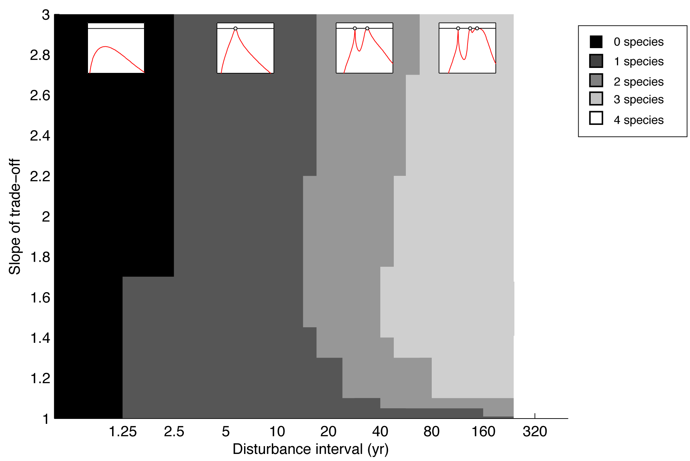

% Modelling trait evolution in forests: machine learning challenges
% Daniel Falster, Rich FitzJohn, Stephen Hardy

# Longer term challenges

-  Identifying when an stochastic evolutionary simulation has stabilised
- estimating fitness in stochastic growth model
- Solving odes
- casting stochastic mutation model as a stochastic DE (e.g. Brownian motion)
- fastest way to assemble evolutionary community
- If you have non-linear differential equations, how do you model uncertainty?
- When you have observations, what can you infer about params of model?

# Short term

\clearpage

## Approximating light environment within a patch

**Routine**: For a patch at any given age, we want to  we calculate the amount of light at height $z$ in a patch of age $a$:

\begin{equation} \label{eq:light}
E(z,a) = \exp \left(-c_{ext}  \sum_{i=1}^{N} \int_{0}^{\infty} \phi(m) \, L(z, h(m)) \, n(x_i, m,a) \, dm \right), \end{equation}
where $\phi(m)$ is total leaf area and $L(z, h(m))$ is fraction of this leaf area held above height $z$ for plants size $m$, and $c_{ext}$ is the light extinction coefficient. As the patch develops, the shape of this function changes (Fig 1.)

**Problem**: Currently, around 25% of time spent making splines of light environment.

**The ML challenge**: Efficiently estimate shape of light curve, with a given accuracy.

\clearpage

## Approximating growth in relation to size

**Routine**: Once constructed, the light environment spline is used to calculate the photosynthesis for plants, which involves integrating a non-linear function over the lgiht environment (Fig 1). We do this for many plants across a range of sizes.

**Problem**: Currently, around 75% of time is spent calculating the physiological rates of individuals. Individuals within a species differ only in their height and light environment. We should be able to speed up simulations by constructing a spline linking growth rate to height.

**The ML challenge**:  Efficiently estimate shape of relationship between growth and size.

\clearpage

## Constructing a fitness landscape

**Routine**: If we have a function $f(x^\prime, \mathbf{x}, \mathbf{s})$ giving the fitness of a rare mutant type with traits $x^\prime$ in competition with residents of traits $\mathbf{x}$ and abundance $\mathbf{s}$, we want to estimate $f$ across a range of values of $x^\prime$ . For example, if $x^\prime$ has two dimensions, we can plot a 2D fitness landscape, as in Fig. 2.

**Problem**: Currently, plotting a 2D landscape with 50x50 =2500 points takes around an hour. This is already a bottleneck, but if we were to estimate fitness in 3 dimensions, this would take 2 days.

**The ML challenge**: Efficiently estimate the shape of the function $f$ for cases where $x^\prime$ has $geq$ 2 dimensions.

\clearpage

## Learning about evolutionary outcomes

**Routine**: Our evolutionary model produces different sorts of mixtures as parameters change, such 1, 2, 3 and 4 species mixtures. We want to plot these outcomes over a range of parameter values, such as in Fig 3.

**Problem**: Each point in Fig 3 may take 1 day to calculate. We have many parameters, and thus a large multi-dimensional space to explore.

**The ML challenge**:  Efficiently explore parameter space, classifying outcomes by

- the number of strategies (discrete, as in Fig 2.)
- the value of traits (continuous).

\clearpage

