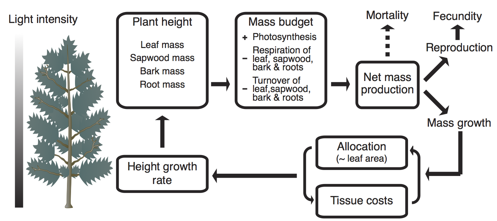

```{r, echo=FALSE}
library(plant)
```

# Introduction

This document outlines the core physiological model used in the `plant`
package. This model has primarily been developed elsewhere, in particular in
@Falster-2011. The model's equations are presented here not as original findings,
but rather so that users can understand the full system of equations being
solved within `plant`.

The purpose of a physiological model in `plant` is to take a plant's
current size, light environment, and physiological parameters as inputs,
and return its growth, mortality, and fecundity rates. In the `FF16`
physiological model, these vital rates are all
derived from the rate at which living biomass is produced by the plant,
which in turn is calculated based on well-understood physiology Fig. \@ref(fig:phys). Various physiological parameters
influence demographic outcomes. Varying these parameters allows accounting for
species differences, potentially via traits (see last
section). Tables \@ref(tab:definitions), \@ref(tab:params-core), \@ref(tab:params-hyper) summarize the
units and definitions of all variables, parameters, and hyper-parameters used in
the material below. 

```{r phys, out.width = '100%', fig.cap="**Physiological model in `plant`, giving demographic rates on the basis of its traits, size, and light environment, as functions of net mass production.** The dashed arrow towards mortality indicates that, although the mortality rate is assumed to depend on mass production, no mass is actually allocated there. Figure adapted from @Falster-2011 and @Falster-2015.", echo=FALSE}

```

# Growth {#growth}

## Leaf photosynthesis {#leaf-photosynthesis}

We denote by $p(x, E)$ the gross rate of leaf photosynthesis per unit
leaf area within the canopy of a plant with traits $x$ at light
level $E(z)$, where $z$ is height within the canopy.
We assume a relationship of the form
\begin{equation}
	p(x, E(z)) = \alpha_{{\rm p1}} \frac{ E(z)}{E(z) + \alpha_{{\rm p2}}},
	(\#eq:photosynthesis)
\end{equation}
for the average of $p$ across the year. The parameters
$\alpha_{{\rm p1}}$ and $\alpha_{{\rm p2}}$ are derived from a detailed leaf-level
model and measure, respectively, maximum annual photosynthesis and the light levels at 50\% of this maximum. The average rate of
leaf photosynthesis across the plant is then
\begin{equation}
\bar{p}(x, H, E_{a}) = \int_0^H p(x, E_a(z)) \, q(z, H) \, {\rm d}z,
(\#eq:photosynthesis-av)
\end{equation}
where $q(z, H)$ is the vertical distribution of leaf area with respect to height $z$ (Eq.
\@ref(eq:crown3)).

## Mass production {#standard-model-for-mass-production}

The amount of biomass available for growth,
${\rm d}B  / {\rm d}t$, is given by the difference between income
(total photosynthetic rate) and losses (respiration and turnover) within the
plant [@Makela-1997, @Thornley-2000, @Falster-2011],
\begin{equation}
\underbrace{\strut \frac{{\rm d}B}{{\rm d}t}}_\textrm{net biomass production}
= \underbrace{\strut \alpha_{\rm bio} }_\textrm{mass per C} \,
\underbrace{\strut \alpha_{\rm y} }_\textrm{yield}
\big( \underbrace{\strut A_{\rm l} \, \bar{p}}_\textrm{photosynthesis} -
\underbrace{\strut \, \sum_{i = {\rm l}, {\rm b}, {\rm s}, {\rm r}}{M_i \, r_i}}_\textrm{respiration}\big)
- \underbrace{\strut \sum_{i = {\rm l}, {\rm b}, {\rm s},  {\rm r}}{M_i \, k_i}}_\textrm{turnover}.
  (\#eq:dbdt)
\end{equation}
Here, $M, r$, and $k$ refer to the mass, maintenance respiration rate, and
turnover rate of different tissues, denoted by subscripts $l$ = leaves,
$b$ = bark, $s$ = sapwood, and $r$ = roots. $\bar{p}$ is the assimilation
rate of CO$_2$ per unit leaf area, $\alpha_{\rm y}$ is yield (i.e., the fraction of
assimilated carbon fixed in biomass, with the remaining fraction being lost
as growth respiration; this comes in addition
to the costs of maintenance respiration), and $\alpha_{\rm bio}$ is the amount of biomass per unit carbon fixed. Gross photosynthetic production is proportional to leaf area,
$A_{\rm l} = M_{\rm l} / \phi$, where $\phi$ is leaf mass per
area. The total mass of living tissues is
$M_{\rm a} = M_{\rm l} + M_{\rm b} + M_{\rm s} + M_{\rm r}.$

## Height growth {#height-growth-rate}

The key measure of growth required by the demographic model is the
rate of height growth, denoted $g(x, H, E_{a})$. To model height growth
requires that we translate mass
production into height increment, accounting for the costs of
building new tissues, allocation
to reproduction, and architectural layout. Using the chain rule, height growth
can be decomposed into a product of physiologically relevant terms
[@Falster-2011],
\begin{equation}
g(x, H, E_{a}) = \frac{{\rm d}H}{{\rm d}t} = \frac{{\rm d}H}{{\rm d}A_{\rm l}}
\times \frac{{\rm d}A_{\rm l} }{{\rm d}M_{\rm a}}
\times \frac{{\rm d}M_{\rm a}}{{\rm d}B}
\times \frac{{\rm d}B}{{\rm d}t}.
(\#eq:dhdt)
\end{equation}

The first factor,
${\rm d}H / {\rm d}A_{\rm l}$, is the growth in plant height
per unit growth in total leaf area -- accounting for the architectural
strategy of the plant. Some species tend to leaf out more than grow
tall, while other species emphasise vertical extension.

The second factor,
${\rm d}A_{\rm l} / {\rm d}M_{\rm a}$, accounts for the
marginal cost of deploying an additional unit of leaf area, including
construction of the leaf itself and various support structures. As such,
${\rm d}A_{\rm l} / {\rm d}M_{\rm a}$ can itself be
expressed as a sum of construction costs per unit leaf area,
\begin{equation}
\frac{{\rm d}A_{\rm l}}{{\rm d}M_{\rm a}}
= \bigg( \frac{{\rm d}M_{\rm l}}{{\rm d}A_{\rm l}} + \frac{{\rm d}M_{\rm s}}{{\rm d}A_{\rm l}} + \frac{{\rm d}M_{\rm b}}{{\rm d}A_{\rm l}} + \frac{{\rm d}M_{\rm r}}{{\rm d}A_{\rm l}}\bigg)^{-1}.
(\#eq:daldmt)
\end{equation}

The third factor,
${\rm d}M_{\rm a} / {\rm d}B$, is the fraction
of net biomass production (Eq. \@ref(eq:dbdt)) that is allocated to
growth rather than reproduction or storage. In the `FF16` physiological model,
we let this growth fraction decrease with height according to the function
\begin{equation}
\frac{{\rm d}M_{\rm a}}{{\rm d}B}(H) = 1 -
\frac{\alpha_{{\rm f1}}} {1 + \exp\left(\alpha_{{\rm f2}} \left(1 - H / H_{\rm mat}\right)\right)},
(\#eq:allocation)
\end{equation}
where $\alpha_{{\rm f1}}$ is the maximum possible allocation ($0-1$) and $\alpha_{{\rm f2}}$
determines the sharpness of the transition [@Falster-2011].

## Diameter growth

Analogously, the growth in basal area $A_{\rm st}$ can be
expressed as the sum of growth in sapwood, bark, and heartwood areas
($A_{\rm s}, A_{\rm b}$, and $A_{\rm h}$, respectively),
\begin{equation}
\frac{{\rm d}A_{\rm st}}{{\rm d}t} = \frac{{\rm d}A_{\rm b}}{{\rm d}t} + \frac{{\rm d}A_{\rm s}}{{\rm d}t} + \frac{{\rm d}A_{\rm h}}{{\rm d}t}.
(\#eq:dA-dst)
\end{equation}

Applying the chain rule, we derive an equation for basal area growth that contains many of the same
elements as Eq. \@ref(eq:dhdt),
\begin{equation}
\frac{{\rm d}A_{\rm st}}{{\rm d}t} = \left(\frac{{\rm d}A_{\rm s}}{{\rm d}A_{\rm l}} + \frac{{\rm d}A_{\rm b}}{{\rm d}A_{\rm l}}\right) \times
\frac{{\rm d}A_{\rm l}}{{\rm d}M_{\rm a}} \times \frac{{\rm d}M_{\rm a}}{{\rm d}B} \times \frac{{\rm d}B}{{\rm d}t} + \frac{{\rm d}A_{\rm h}}{{\rm d}t} .
(\#eq:dast)
\end{equation}
Diameter growth is then given by the geometric relationship between stem
diameter $D$ and $A_{\rm st}$,
\begin{equation}
\frac{{\rm d}D}{{\rm d}t} = \left(\pi \, A_{\rm st}\right)^{-0.5} \, \frac{{\rm d}A_{\rm st}}{{\rm d}t}.
(\#eq:dDdt)
\end{equation}

# Functional-balance model for allocation {#a-functional-balance-model-for-allocation}

Here we describe an allometric model linking to a plant's height its various other size dimensions
required by most ecologically realistic vegetation models
(i.e., the masses of leaves, sapwood, bark, and fine
roots). This approach allows us to track only the
plant's height, while still accounting for the mass needs to build
leaves, roots, and stems. The growth rates of various tissues can then
also be derived (Table \@ref(tab:allometry)).

## Leaf area {#leaf-area}

Based on empirically observed allometry [@Falster-2011], we assume an allometric power-law
scaling relationship between the accumulated leaf area of a plant and
its height,
\begin{equation}
H = \alpha_{{\rm l1}} \, \left(A_{\rm l} \, {\rm m^{-2}}\right)^{\alpha_{{\rm l2}}}.
(\#eq:ha)
\end{equation}
This relationship is normalised around a leaf area of 1m${^2}$.

## Vertical distribution of leaf area {#vertical-distribution-of-leaf-area}

We follow the model of @Yokozawa-1995 describing the vertical
distribution of leaf area within the crowns of individual plants. This
model can account for a variety of canopy profiles through a single
parameter $\eta$. Setting $\eta = 1$ results in a conical canopy, as
seen in many conifers, while higher values, e.g., $\eta = 12$ , give a
top-heavy canopy profile similar to those seen among angiosperms. We denote
by $A_{{\rm s},z}$ the sapwood area at height $z$ within the plant, by $q(z, H)$ the vertical distribution of leaf area of
leaf area with respect to height $z$, and by $Q(z, H)$ the cumulative fraction of a
plant's leaves above height $z$. As defined previously, $A_{\rm s}$ is the sapwood
area at the base of the plant. Following @Yokozawa-1995, we
assume a relationship between $A_{{\rm s},z}$ and height such that
\begin{equation} 
\frac{A_{{\rm s},z}}{A_{\rm s}} = \left(1 - \left(\frac{z}{H}\right)^\eta\right)^2.
(\#eq:crown1)
\end{equation}

We also assume that each unit of leaf area is supported by a fixed area $\theta$ of
sapwood [in agreement with the pipe model; @Shinozaki-1964], so that the total canopy
area of a plant relates to its basal sapwood area $A_{\rm s}$,
\begin{equation}
A_{\rm s} = \theta \, A_{\rm l}.
(\#eq:crown2)
\end{equation}
The pipe model is assumed to hold within individual plants, as well as
across plants of different size. It follows that,

\begin{equation}
Q(z, H) = \left(1-\left(\frac{z}{H}\right)^\eta\right)^2.
(\#eq:crown1)
\end{equation}

Differentiating with respect to $z$ then yields a solution for the
probability density of leaf area as a function of height,
\begin{equation}
q(z, H) = 2\frac{\eta}{H}\left(1-\left(\frac{z}{H}\right)^{\eta}\right) \left(\frac{z}{H}\right)^{\eta-1}.
(\#eq:crown3)
\end{equation}

## Sapwood mass {#mass-of-sapwood}

Integrating $A_{{\rm s},z}$ yields the total mass of
sapwood in a plant,
\begin{equation}
M_{\rm s}  = \rho \int_0^H A_{{\rm s},z} \, {\rm d}z = \rho A_{\rm s} H \eta_{\rm c} ,
(\#eq:ms1)
\end{equation}
where $\eta_{\rm c} = 1 - \frac{2}{1 + \eta} + \frac{1}{1 + 2\eta}$
[@Yokozawa-1995]. Substituting from Eq. \@ref(eq:crown2)  into Eq.
\@ref(eq:ms1) then gives an expression for sapwood mass as a function of
leaf area and height,
\begin{equation}
M_{\rm s} = \rho \, \eta_{\rm c} \, \theta \, A_{\rm l}  \, H.
(\#eq:ms2)
\end{equation}

## Bark mass {#bark-mass}

Bark and phloem tissue are modelled using an analogue of the pipe model,
leading to a similar equation as that for sapwood mass (Eq.
\@ref(eq:ms2)). The cross-section area of bark per unit leaf area is
assumed to be a constant fraction $\alpha_{{\rm b1}}$ of sapwood area per unit leaf
area such that
\begin{equation}
M_{\rm b} = \alpha_{{\rm b1}} M_{\rm s}.
(\#eq:mb)
\end{equation}

## Root mass {#root-mass}

Also consistent with the pipe model, we assume a fixed ratio of
root mass per unit leaf area,
\begin{equation}
M_{\rm r} = \alpha_{{\rm r1}} \, A_{\rm l}.
(\#eq:mr)
\end{equation}
Even though nitrogen and water uptake are not modelled explicitly,
imposing a fixed ratio of root mass to leaf area ensures that
approximate costs of root production are included in calculations of
carbon budget.

# Seed production {#seed-production}

The rate of seed production, $f(x, H, E_{a})$, is a direct
function of the mass allocated to reproduction,
\begin{equation}
f(x, H, E_{a}) = \frac{(1 - \frac{{\rm d}M_{\rm a}}{{\rm d}B}) \times \frac{{\rm d}B}{{\rm d}t}}{
\omega + \alpha_{{\rm f3}}},
(\#eq:fecundity)
\end{equation}
where $\omega$ is the mass of the seed and $\alpha_{{\rm f3}}$ is the cost
per seed of accessories, such as fruits, flowers, and dispersal
structures. The function $\frac{{\rm d}M_{\rm a}}{{\rm d}B}$ is the fraction
of $\frac{{\rm d}B}{{\rm d}t}$ that is allocated to growth (from Eq. \@ref(eq:allocation), while
$1-\frac{{\rm d}M_{\rm a}}{{\rm d}B}$ gives the fraction allocated
to reproduction).

# Mortality {#mortality}

Instantaneous rates of plant mortality are given by the sum of a growth-independent and a growth-dependent rate
[@Falster-2011, @Moorcroft-2001],
\begin{equation}
d(x, H, E_{a}) = d_{{\rm I}}(x, H) + d_{{\rm G}}(x, H, E_{a}).
(\#eq:mortality)
\end{equation}
The growth-independent rate is taken to be constant, independent of
plant performance, but potentially varying with species traits. The
growth-dependent rate is assumed to decline exponentially with the rate
of mass production per unit leaf area,
\begin{equation}
d_{{\rm G}}(x, H, E_{a}) = \alpha_{{\rm dG1}} \exp(-\alpha_{{\rm dG2}} X),
(\#eq:mortality-GD)
\end{equation}
where $X = {\rm d}B/{\rm d}t / A_{\rm l}$. This
relationship allows for plants to increase in mortality as their growth rate
approaches zero, while allowing for species to differ in
the parameters $\alpha_{{\rm dG1}}$ and $\alpha_{{\rm dG2}}$.

We also require a function $S_{\rm G}  (x^\prime, H_0, E_{{\rm a}0})$ for plant survival
through germination. For the demographic model to behave smoothly,
$S_{\rm G}  (x^\prime, H_0, E_{{\rm a}0}) / g(x, H_0, E_{{\rm a}0})$ should approach zero as
$g(x, H_0, E_{{\rm a}0})$ approaches zero. Following @Falster-2011,
we use the function
\begin{equation}
S_{\rm G} (x^\prime, H_0, E_{{\rm a}0}) = \frac1{1 + X^2},
(\#eq:pi1)
\end{equation}
where $X = \alpha_{{\rm d0}} \frac{A_{\rm l}}{{\rm d}B / {\rm d}t}$ and $\alpha_{{\rm d0}}$ is a
constant. Eq. \@ref(eq:pi1) is consistent with Eq.
\@ref(eq:mortality-GD), as both cause survival to decline with mass production.

# Hyper-parameterisation of physiological model via traits {#traits}

The `FF16` physiological model includes default values for all needed parameters
(Table \@ref(tab:params-core)). Species are known to vary considerably
in many of these parameters, such as $\phi$, $\rho$, $\nu$, and $\omega$; so by varying parameters
one can account for species differences. When altering a parameter in the model, however,
one must also consider whether there are trade-offs linking parameters.

`plant` allows for the
hyper-parameterisation of the `FF16` physiological model via plant functional traits: this enables
simultaneous variation in multiple parameters in accordance with an assumed trade-off. In the
`FF16` physiological model, we implement the relationships described below. For more
details, see `make_FF16_hyperpar.R`.

## Leaf mass per unit area

The trait leaf mass per unit area, denoted by $\phi$, directly influences growth by changing
${\rm d}A_{\rm l} / {\rm d}M_{\rm a}$. In addition, we
link $\phi$ to the rate of leaf turnover,
based on a widely observed scaling relationship from @Wright-2004,
\begin{equation}
k_{\rm l} = \beta_{{\rm kl1}} \, \left(\frac{\phi}{\phi_0}\right)^{-\beta_{{\rm kl2}}}.
(\#eq:k-l)
\end{equation}

This relationship is normalised around $\phi_0$, the global mean of $\phi$. This
allows us to vary $\beta_{{\rm kl1}}$ and $\beta_{{\rm kl2}}$ without displacing the relationship from the
observed mean.

We also vary the mass-based leaf respiration rate so that it stays constant per unit leaf area and
varies with $\phi$ and nitrogen per unit leaf area $\nu$, as empirically observed by @Wright-2004,
\begin{equation}
r_{\rm l} = \frac{\beta_{{\rm lf4}}\, \nu}{\phi}.
(\#eq:rl)
\end{equation}


## Wood density

The trait wood density, denoted by $\rho$, directly influences growth by changing
${\rm d}A_{\rm l} / {\rm d}M_{\rm a}$. In addition, we allow for
$\rho$ to influence the rate of growth-independent mortality,
\begin{equation}
d_{\rm I} = \beta_{{\rm dI1}} \, \left(\frac{\rho}{\rho_0}\right) ^ {-\beta_{{\rm dI2}}},
(\#eq:dI)
\end{equation}

and also the rate of sapwood turnover,
\begin{equation}
k_{\rm s} = \beta_{{\rm ks1}} \, \left(\frac{\rho}{\rho_0}\right)^ {-\beta_{{\rm ks2}}},
(\#eq:ks)
\end{equation}

As for $\phi$, these relationships are normalized around $\rho_0$, the global mean of $\rho$.
By default, $\beta_{{\rm kI2}}$ and $\beta_{{\rm ks2}}$ are set to zero, so these linkages
only become present when these parameters are set to something other than their default values.

The rate of sapwood respiration per unit volume is assumed to be constant, so
sapwood respiration per unit mass varies as
\begin{equation}
r_{\rm s}  = \frac{\beta_{{\rm rs1}}}{\rho},
(\#eq:rs)
\end{equation}

where $\beta_{{\rm rs1}}$ is a default rate per volume of sapwood.
Similarly, the rate of bark respiration per unit mass varies as
\begin{equation}
r_{\rm b} = \frac{\beta_{{\rm rb1}}}{\rho},
(\#eq:rb)
\end{equation}

with $\beta_{{\rm rb1}} = 2 \beta_{{\rm rs1}}$.

## Seed mass

Effects of the trait seed mass, denoted by $\omega$, are naturally embedded in the equation determining
fecundity (Eq. \@ref(eq:fecundity)) and the initial height of seedlings. In addition,
we let the accessory cost per seed be a multiple of seed size,
\begin{equation}
\alpha_{{\rm f3}} = \beta_{{\rm f1}} \omega,
(\#eq:a-f3)
\end{equation}
as empirically observed [@Henery-2001].

## Nitrogen per unit leaf area

Photosynthesis per unit leaf area and respiration rates per unit leaf mass (or area) are assumed to vary with leaf nitrogen per unit area, $\nu$. The calculation of respiration rates is already described above. To calculate the average annual photosynthesis for a leaf, we integrate the instantaneous rate per unit leaf area over the annual solar trajectory, using a rectangular-hyperbolic photosynthesis light response curve, 
\begin{equation}
p(\nu, E) = \frac1{365 \textrm{d}}\int_0^{365 \textrm{d}}\frac{Y(t) + A_{\rm max} - \sqrt{(Y(t) + A_{\rm max})^2 - 4 \beta_{{\rm lf2}} Y(t) A_{\rm max} }}{2 \beta_{{\rm lf2}}} {\rm d}t,
(\#eq:ptss)
\end{equation}
where

- $A_{\rm max}$ is the maximum photosynthetic capacity of the leaf,
- $\beta_{{\rm lf2}}$ is the curvature of the light response curve,
- $Y(t) = \beta_{{\rm lf3}} I(t)$ is the initial yield of the light response curve, with $\beta_{{\rm lf3}}$ being the quantum yield parameter,
- $I(t) = k_{\rm I} \, I_0(t)\, E$ is the intensity of light on the leaf surface, and
- $I_0(t)$ is light incident on a surface perpendicular to the sun's rays directly above the canopy at time $t$.

The profile of $I_0(t)$ is given by a solar model adapted from @TerSteege-1997.

We allow for the maximum photosynthetic capacity of the leaf to vary with leaf nitrogen per unit area, as
\begin{equation}
A_{\rm max} = \beta_{{\rm lf1}} \, \left(\frac{\nu}{\nu_0}\right)^{\beta_{{\rm lf5}}},
(\#eq:amax)
\end{equation}
where $\beta_{{\rm lf1}}$ and $\beta_{{\rm lf5}}$ are constants. The relationships is normalized around $\nu_0$, the global mean of leaf nitrogen per unit area.

Values of $p(\nu, E)$ are calculated across a range of values of $E$, and then an expression of the form in Eq. \@ref(eq:photosynthesis) is fitted to extract the parameters
$\alpha_{{\rm p1}}$ and $\alpha_{{\rm p2}}$, such that these become functions of $\nu$.

# Tables {#tables}

```{r functions, echo=FALSE}
extract_strategy_parameter_values <- function(vars){

  s <- c(FF16_Strategy(),
         lapply(as.list(args(make_FF16_hyperpar)), eval))
  
  out <- rep(NA_character_, length(vars))

  # Now extract values from plant
  to_code <- vars != "" & vars %in% names(s)
  code <- vars[to_code]

  val <- s[code]
  err <- sapply(val, is.null)
  if (any(err)) {
    message("Missing parameters: ", paste(code[err], collapse=", "))
  }

  oo <- options(scipen=999)
  on.exit(options(oo))
  out[to_code] <- unlist(lapply(val, prettyNum))
  out[is.na(out)] <- ""

  out
}
```

```{r definitions, echo=FALSE, results='asis'}
x <- read.csv("assets/FF16-vars.csv", stringsAsFactors = FALSE)
# TODO: can we get groups as headers spanning multiple columns?
knitr::kable(x,  align = "l",
  caption = 'Key variables of the `FF16` physiological model. For mass ($M$), respiration ($r$), and turnover ($k$) variables, subscripts refer to any of the following tissues: ${\\rm l}$ = leaves, ${\\rm b}$ = bark, ${\\rm s}$ = sapwood,${\\rm r}$ = roots, ${\\rm a}$ = all living tissue. For area $A$ variables, subscripts refer to any of the following: ${\\rm l}$ = leaves, ${\\rm st}$ = total stem cross-section, ${\\rm s}$ = sapwood cross-section, ${\\rm b}$ = bark cross-section, ${\\rm h}$ = heartwood cross-section'
)
```

```{r allometry, echo=FALSE, results='asis'}
x <- read.csv("assets/FF16-eqns.csv", stringsAsFactors = FALSE)
knitr::kable(x,  align = "l",
  caption = 'Equations of the allometric growth model implemented within the `FF16` physiological model, based on functional-balance assumptions (see text for details). In (a) we list  key assumptions of allocation model between specific variation with leaf area, under "Function". From these assumptions, allocation functions are derived for tissue areas and tissue masses (b). Also the growth rate of each tissue type can be expressed as a function of the growth rate of leaf area. For mass ($M$), respiration ($r$), and turnover ($k$) variables, subscripts refer to any of the following tissues: ${\\rm l}$ = leaves, ${\\rm b}$ = bark, ${\\rm s}$ = sapwood, ${\\rm r}$ = roots, ${\\rm a}$ = all living tissue. For area $A$ variables, subscripts refer to any of the following: ${\\rm l}$ = leaves, ${\\rm st}$ = total stem cross-section, ${\\rm s}$ = sapwood cross-section, ${\\rm b}$ = bark cross-section, ${\\rm h}$ = heartwood cross-section'
)
```

```{r params-core, echo=FALSE, results='asis'}

x <- read.csv("assets/FF16-params-core.csv", stringsAsFactors = FALSE)
x$Value <- extract_strategy_parameter_values(x$Code)
knitr::kable(x,  align = "l",
  caption = 'Core parameters of the `FF16` physiological model.'
)
```


```{r params-hyper, echo=FALSE, results='asis'}
x <- read.csv("assets/FF16-params-hyper.csv", stringsAsFactors = FALSE)
x$Value <- extract_strategy_parameter_values(x$Code)
knitr::kable(x,  align = "l",
  caption = 'Parameters for hyper-parameterisation of the `FF16` physiological model.'
)
```


# References
