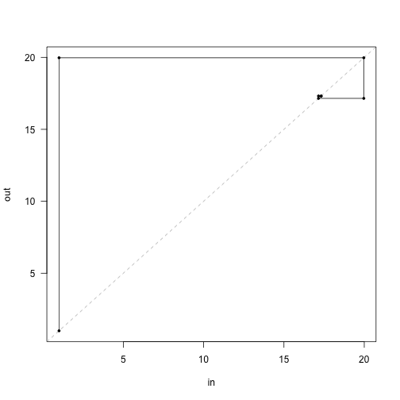
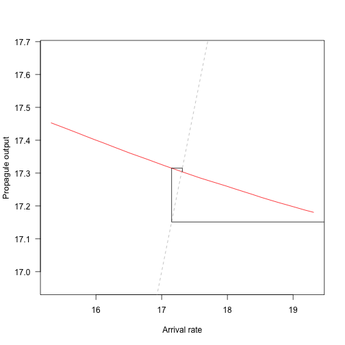
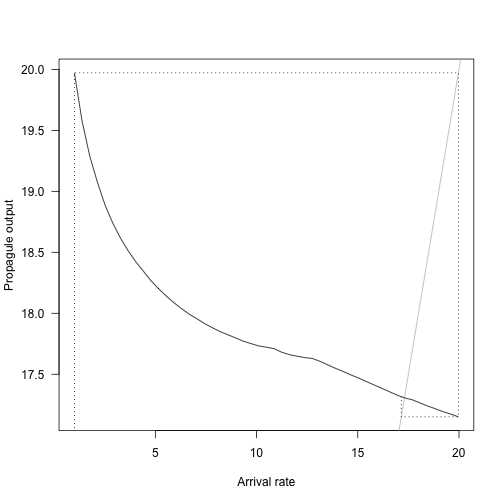
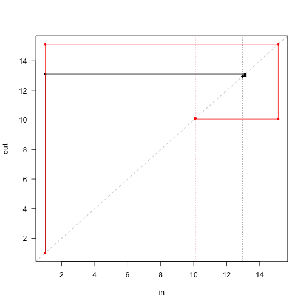

<!-- This file is generated from the Rmd in inst/slow_vignettes. Make any edits there-->

# Background

An inherent assumption of the `plant` solver is that propagules / offspring arrive at a constant rate during patch development (here called `seed_rain`), some of which survive and established, based on the competitive environment within a patch. Patches also produce new propagules that in turn colonise other patches in the meta-community.

We can use this relationship of propagule input and output to find the demographic equilibrium of patches with one or more species, that is, the patch structure at which propagule input equals propagule output.


```r
library(plant)
library(parallel)
n_cores = max(1, detectCores() - 1)

params <- scm_base_parameters("FF16")
patch <- expand_parameters(trait_matrix(0.0825, "lma"), params, mutant = FALSE)
```

# Propagule arrival (seed rain)

Patch arrival rate can be set via `seed_rain`. After running the patch characteristic solver, the output `seed_rains` provides the number of propagules produced during patch development:


```r
generate_propagule_output <- function(arrival_rate, p) {
  p$seed_rain <- arrival_rate
  run_scm(p)$seed_rains
}

generate_propagule_output(1.0, patch)
```

```
## [1] 19.8244
```

```r
generate_propagule_output(10.0, patch)
```

```
## [1] 17.63186
```

```r
generate_propagule_output(50.0, patch)
```

```
## [1] 16.58917
```
We see that propagule output decreases as arrival rates increase, presumably due to increased competition from crowding.

# Finding equilibrium

When below the equilibrium, `seed_rain_out` returns a propagule output that is greater than the arrival rate, when above it, `seed_rain_out` returns a propagule output rate less than the arrival rate. We find demographic equlibrium by chaining several patch models together, reusing the output of one patch as the input for the next.

This functionality is provided by `equilibrium_seed_rain`. We enable logging to better demonstrate what is happening under the hood:


```r
plant_log_console()
```

```
## [2021-05-05 12:53:34.214] Activating logging to console
```

```r
patch_eq <- equilibrium_seed_rain(patch)
```

```
## [2021-05-05 12:53:34.223] equilibrium> Solving seed rain using iteration
## [2021-05-05 12:53:35.145] schedule> 1: Splitting {20} times (141)
## [2021-05-05 12:53:36.117] schedule> 2: Splitting {9} times (161)
## [2021-05-05 12:53:37.147] equilibrium> eq> 1: {1} -> {19.97185} (delta = {18.97185})
## [2021-05-05 12:53:38.652] schedule> 1: Splitting {34} times (141)
## [2021-05-05 12:53:40.611] schedule> 2: Splitting {27} times (175)
## [2021-05-05 12:53:42.879] schedule> 3: Splitting {9} times (202)
## [2021-05-05 12:53:45.105] schedule> 4: Splitting {1} times (211)
## [2021-05-05 12:53:47.330] equilibrium> eq> 2: {19.97185} -> {17.15125} (delta = {-2.820598})
## [2021-05-05 12:53:49.790] schedule> 1: Splitting {1} times (212)
## [2021-05-05 12:53:52.231] equilibrium> eq> 3: {17.15125} -> {17.31508} (delta = {0.1638286})
## [2021-05-05 12:53:54.629] equilibrium> eq> 4: {17.31508} -> {17.30373} (delta = {-0.01134974})
## [2021-05-05 12:53:54.629] equilibrium> Reached target accuracy (delta 1.13497e-02, 6.55483e-04 < 1.00000e-03 eps)
```
Here, the characteristic solver is run four times. At each iteration, the arrival rate is mapped to a propagule output (e.g. `{1} -> {19.97}`), with proagule outputs used as the arrival rate for the next iteration. `delta` shows the difference between input and output and the process is repeated until an accuracy target is reached (i.e. there is little difference between input an output.)

<!-- TODO: provide better description of adaptive sampling -->
Note that logging also demonstrates adaptive cohort spacing algorthim that `plant` uses to refine the time steps and arrival schedule, splitting cohorts where greater accuracy is required. More on timing can be found in the [cohort scheduling algorithm](https://traitecoevo.github.io/plant/articles/cohort_spacing.html).

In this example, we see that propagule outputs quickly approach demographic equilibrium. These values can be accessed using the `progress` attribute and visualised with a cobweb plot:

```r
cobweb <- function(m, ...) {
  lines(rep(m[,1], each=2), c(t(m)), ...)
}

approach <- attr(patch_eq, "progress")
r <- range(approach)

plot(approach, type="n", las=1, xlim=r, ylim=r)
abline(0, 1, lty=2, col="grey")
cobweb(approach, pch=19, cex=.5, type="o")
```


This shows the first iteration (left) producing nearly 20 propagules, which in turn generate around 17, and so on.

# Near equilibrium

The iterative approach is valuable when the relationship between arrival rate and propagule output is highly non-linear. Near equilibrium, however, can examine this relationship more closely:


```r
# Range of arrival rates
dr <- 2
arrival_rates <- seq(patch_eq$seed_rain - dr,
                    patch_eq$seed_rain + dr, length.out=31)

# Run patches
propagule_outputs <- unlist(mclapply(arrival_rates, generate_propagule_output, 
                                     patch_eq, mc.cores = n_cores))

# Plot interpolated relationship
plot(arrival_rates, propagule_outputs, xlab="Arrival rate",
     ylab="Propagule output", las=1, type="l", asp=5, col="red")

# Compare with iteration
abline(0, 1, lty=2, col="grey")
cobweb(approach)
```




# Global function shape

It is possible, if not expensive, to evaluating the global shape of the relationship between arrival rate and propagule output. We expect patch development to differ across a wider range of arrival rates, and therefore use `build_schedule` to allow the `plant` solver to adaptively refine the arrival schedule to a desired level of accuracy (as seen in the `equilibrium_seed_rain` function):


```r
# Adaptive scheduling
generate_propagule_output_adaptive <- function(arrival_rate, p) {
  p$seed_rain <- arrival_rate
  res <- build_schedule(p)
  attr(res, "seed_rain_out")
}

# Loop over range of arrival rates
arrival_rates_global <- seq(1, max(approach), length.out=51)
propagule_output_global <- unlist(mclapply(arrival_rates_global,
                                           generate_propagule_output_adaptive,
                                           patch, mc.cores = n_cores))

# This is pretty patchy, which is due to incompletely refining the
# cohort schedule, I believe.  Tighten `schedule_eps` to make the
# curve smoother, at the cost of potentially a lot more effort.
plot(arrival_rates_global, propagule_output_global,
     las=1, type="l",
     xlab="Arrival rate", ylab="Propagule output")

# Compare with iteration
abline(0, 1, lty=1, col="grey")
cobweb(approach, lty=3)
```



Here we see the non-linear relationship of propagule output declining as arrival rates increase. The dashed grey lines show the iterative equilibrium finding results, and the solid grey line shows the point at which propagule outputs decline below arrival rates.

# 5. Multiple species at once:

As always, this example is simple to extend to patches of competing species:


```r
lma <- c(0.0825, 0.15)
patch_2sp <- expand_parameters(trait_matrix(lma, "lma"), params, mutant = FALSE)

patch_2sp_eq <- equilibrium_seed_rain(patch_2sp)
```

```
## [2021-05-05 12:55:45.952] equilibrium> Solving seed rain using iteration
## [2021-05-05 12:55:48.304] schedule> 1: Splitting {10,22} times (141,141)
## [2021-05-05 12:55:50.838] schedule> 2: Splitting {1,9} times (151,163)
## [2021-05-05 12:55:53.503] schedule> 3: Splitting {0,1} times (152,172)
## [2021-05-05 12:55:56.217] equilibrium> eq> 1: {1, 1} -> {13.10296, 15.12509} (delta = {12.10296, 14.12509})
## [2021-05-05 12:55:59.512] schedule> 1: Splitting {17,26} times (141,141)
## [2021-05-05 12:56:03.666] schedule> 2: Splitting {4,25} times (158,167)
## [2021-05-05 12:56:08.243] schedule> 3: Splitting {1,12} times (162,192)
## [2021-05-05 12:56:13.040] equilibrium> eq> 2: {13.10296, 15.12509} -> {12.97355, 10.06157} (delta = {-0.1294116, -5.063523})
## [2021-05-05 12:56:17.538] equilibrium> eq> 3: {12.97355, 10.06157} -> {12.95027, 10.11194} (delta = {-0.02327727, 0.05037422})
## [2021-05-05 12:56:22.239] equilibrium> eq> 4: {12.95027, 10.11194} -> {12.95139, 10.11231} (delta = {0.001122739, 0.0003662433})
## [2021-05-05 12:56:22.240] equilibrium> Reached target accuracy (delta 1.12274e-03, 8.66962e-05 < 1.00000e-03 eps)
```

```r
approach <- attr(patch_2sp_eq, "progress")
```

Both species rapidly hone in on the equilibrium:


```r
r <- range(unlist(approach))

plot(approach[[1]], type="n", las=1, xlim=r, ylim=r, xlab="in", ylab="out")
abline(0, 1, lty=2, col="grey")

cols <- c("black", "red")
for (i in 1:2) {
  cobweb(approach[, i + c(0, 2)], pch=19, cex=.5, type="o", col=cols[[i]])
}
abline(v=patch_2sp_eq$seed_rain, col=1:2, lty=3)
```



Note that the first guess position of the red species is higher than the black species, but in the end the output seed rain is lower.  

This is the difficulty in computing multi species equilibria - the different solutions affect each other.  In general multi-dimensional root finding is difficult; even knowing that there are roots is not straightforward, much less proving that we've converged on the "correct" root (for example [0,0] is a root in this case but that root is not stable).

`plant` uses some heuristics to try to ensure that the root returned is an attracting point but sequentially applying rounds of iteration and non-linear root finding algorithms, as well as rescaling seed rains to repel from known unstable roots.

To illustrate this a little further, though still in the fairly
trivial 2d case, first identify the other two equilibria.


```r
patches <- mclapply(lma, function(x) equilibrium_seed_rain(
  expand_parameters(trait_matrix(x, "lma"), params, mutant = FALSE)),
  mc.cores = n_cores)
```

Here's the seed rains of each species when alone:


```r
propagule_outputs <- sapply(patches, function(x) x$seed_rain)
```

So that means that we have *four* equilibria:
1: The trivial equilibrium:


```r
eq00 <- c(0, 0)
generate_propagule_output(eq00, patch_2sp_eq) - eq00
```

```
## [1] 0 0
```

2: Species 1 alone


```r
eq10 <- c(propagule_outputs[[1]], 0)
generate_propagule_output_adaptive(eq10, patch_2sp) - eq10
```

```
## [2021-05-05 12:56:58.670] schedule> 1: Splitting {38,0} times (141,141)
## [2021-05-05 12:57:02.339] schedule> 2: Splitting {22,0} times (179,141)
## [2021-05-05 12:57:06.594] schedule> 3: Splitting {11,0} times (201,141)
## [2021-05-05 12:57:11.014] schedule> 4: Splitting {1,0} times (212,141)
```

```
## [1] -0.009378477  0.000000000
```

3: Species 2 alone


```r
eq01 <- c(0, propagule_outputs[[2]])
generate_propagule_output_adaptive(eq01, patch_2sp) - eq01
```

```
## [2021-05-05 12:57:19.259] schedule> 1: Splitting {0,44} times (141,141)
## [2021-05-05 12:57:24.259] schedule> 2: Splitting {0,27} times (141,185)
## [2021-05-05 12:57:30.115] schedule> 3: Splitting {0,19} times (141,212)
## [2021-05-05 12:57:36.686] schedule> 4: Splitting {0,11} times (141,231)
```

```
## [1] 0.000000000 0.009307755
```

4: Species 1 and 2 together:


```r
eq11 <- patch_2sp$seed_rain
generate_propagule_output(eq11, patch_2sp) - eq11
```

```
## [1] 12.09120 13.14076
```


Like before, we can describe the global relationship of arrival rate to propagule output by manually running patches for each combination of arrival rates of both species. We turn logging off because this is a looong loop:


```r
# note that the approximations here mean that these equilibria are not
# terribly well polished - there are a set of nested approximations that make
# this difficult. Possibly the biggest culprit is the cohort refinement step

plant_log_console(file_name = "stdout")
```

```
## [2021-05-05 12:57:45.676] Activating logging to output
## [2021-05-05 12:57:45.676] Activating logging to output
```

```r
len <- 21
dx <- max(propagule_outputs) / (len - 1)
n1 <- seq(0.001, by=dx, to=propagule_outputs[[1]] + dx)
n2 <- seq(0.001, by=dx, to=propagule_outputs[[2]] + dx)
nn_in <- as.matrix(expand.grid(n1, n2))
tmp <- mclapply(unname(split(nn_in, seq_len(nrow(nn_in)))),
                generate_propagule_output_adaptive, patch_2sp,
                mc.cores = n_cores)
nn_out <- do.call("rbind", tmp)

len <- log(rowSums(sqrt((nn_out - nn_in)^2)))
rlen <- len / max(len) * dx * 0.8

theta <- atan2(nn_out[, 2] - nn_in[, 2], nn_out[, 1] - nn_in[, 1])

x1 <- nn_in[, 1] + rlen * cos(theta)
y1 <- nn_in[, 2] + rlen * sin(theta)
```

<!-- TODO: check that vector field is the correct term here -->
We visualise these results using a two dimensional vector field:


```r
# NOTE: I'm not sure why the point really close to the equilibrium here looks
# like it's moving so quickly, and possibly in the wrong direction.  
# Cohort instability perhaps?


plot(nn_in, xlab="Species 1", ylab="Species 2", pch=19, cex=.25,
     col="grey", asp=1)
arrows(nn_in[, 1], nn_in[, 2], x1, y1, length=0.02)
lines(rbind(approach[1, 1:2], approach[, 3:4]), type="o", col="red",
      pch=19, cex=.5)
points(patch_2sp_eq$seed_rain[[1]], patch_2sp_eq$seed_rain[[2]], pch=19)
points(rbind(eq00, eq10, eq01))
```


