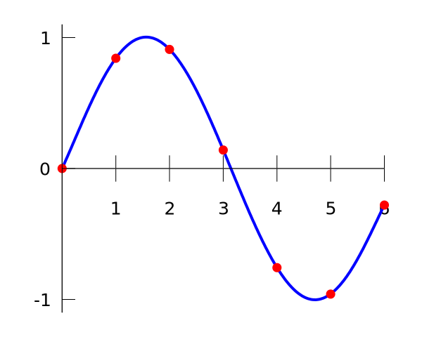

```{r }
library(plant)
```

## Introduction 

Extrinsic Drivers are simply functions over time that are used as inputs at various points in the `plant` solver (SCM) in order to control the influence of
external variables. Due to the flexibility of the implementation, the functions can typically either be set up very easily or customised to handle complex
sets of data. This document goes through examples of setting up Extrinsic Drivers throughout `plant`.

When handling complex functions that vary over time, Extrinsic Drivers are created via interpolation. Control points are passed as input, and the 
system creates a smooth function that interpolates the control points:

[{width="400"}](https://en.wikipedia.org/wiki/Polynomial_interpolation)

## Rainfall
Rainfall is handled inside `FF16w_Environment`, and is set upon construction. If nothing is passed to `make_environment`, rainfall
will default to a value of `1`:
```
env <- make_environment("FF16w")
```
Otherwise, it can either be a constant:
```
env <- make_environment("FF16w", rainfall=3.14)
```
... or varying over time, by providing a list with `x` and `y` control points (ie the point pairs are `(x[i], y[i])`):
```
x_pts <- seq(0, 200, 1)
rain <- list(
  x = x_pts,
  y = 1 + sin(x_pts)
)
env <- make_environment("FF16w", rainfall=rain)
```
The resulting function of rainfall over time can then be evaluated at any time. Note how the point of evaluation was not one of the control points passed in - we
are able to get rainfall at time `5.634` because of the smooth interpolated function.
```
env$extrinsic_drivers$evaluate("rainfall", 5.634)
```
We can also evaluate the function at a list of times, and get a list of rainfall values at those times as a result:
```
env$extrinsic_drivers$evaluate_range("rainfall", c(5, 1.2, 78.345))
```

## Birth rates
Per species birth rates are set via the `expand_parameters()` function. Each object in the list is either a constant number or an embedded list with `x` and `y` control points. There must be the same number of items in the list as there are species:
```
p0 <- scm_base_parameters("FF16")
  
# two species
lmas <- trait_matrix(c(0.0825, 0.125), "lma")

x_pts <- seq(0, 200)
birth_rates <- list(
    species1 = list(x = x_pts, y = 1 + sin(x_pts)),
    species2 = 3.14
  )
  
p1 <- expand_parameters(lmas, p0, FF16_hyperpar, FALSE, birth_rates)

# set up env and ctrl...
out <- run_scm(p1, env, ctrl)
```
Evaluating the birth rate can either be done at the individual species level:
```
s1 <- FF16_Species(p1$strategies[[1]])
s1$extrinsic_drivers$evaluate("birth_rate", 7)
```
... or after the SCM has run:
```
out <- run_scm(p1, env, ctrl)
out$patch$species[[1]]$extrinsic_drivers$evaluate("birth_rate", 7)
```