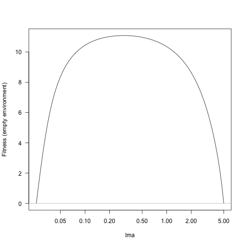
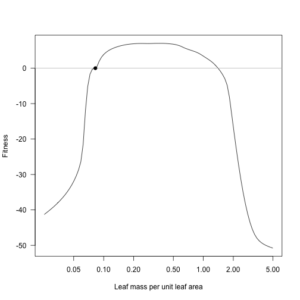
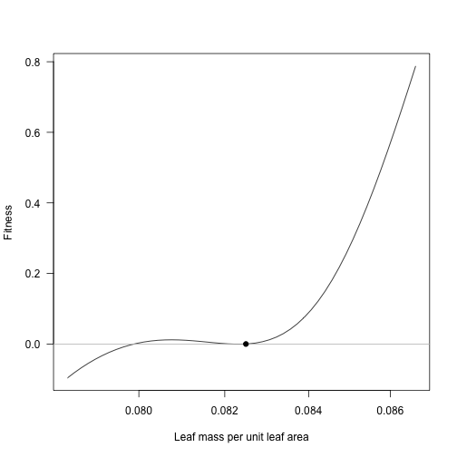
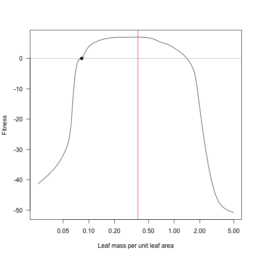
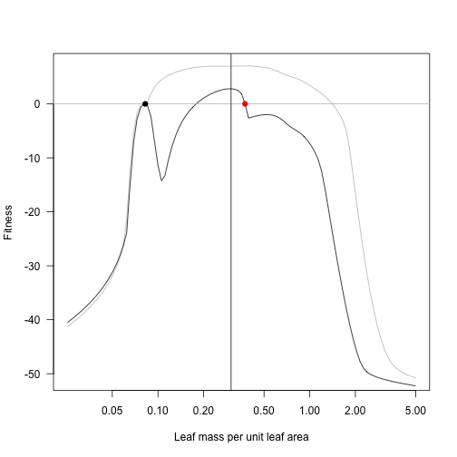
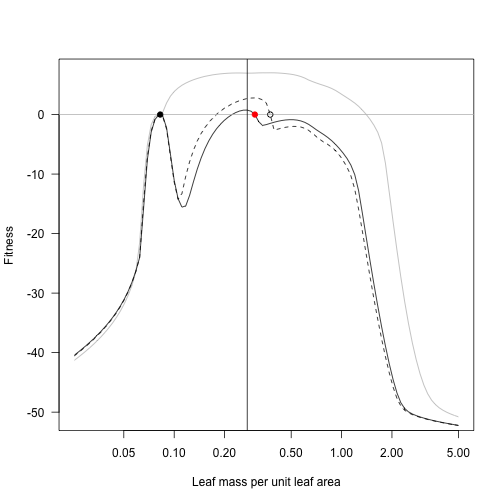

<!-- This file is generated from the Rmd in inst/slow_vignettes. Make any edits there-->


# Background

<!-- TODO: movtivate fitness calculations -->

Start by setting a few parameters; this is the base set of
parameters we'll use.


```r
library(plant)
library(parallel)
n_cores = max(1, detectCores() - 1)

params <- scm_base_parameters("FF16")
params$control$equilibrium_solver_name <- "hybrid"
```

# Fitness landscape

<!-- TODO: describe what `viable_fitness` is doing -->

First, compute the space that any strategy can exist along the
leaf mass area (LMA) axis:


```r
bounds <- viable_fitness(bounds_infinite("lma"), params)
bounds
```

```
##          lower    upper
## lma 0.02533822 4.989169
```

Generate a set of trait values across this range and compute the
fitness landscape:


```r
lma <- trait_matrix(seq_log_range(bounds, 101), "lma")
fitness <- fitness_landscape(lma, params)

plot(lma, fitness, type="l", log="x", las=1, ylab="Fitness (empty environment)")
abline(h=0, col="grey")
```



# Simulating arrivals

Any trait value along this point can persist, so start with random sample:

<!-- Fixing points for reproducibility -->


```r
lma_sample <- c(0.062, 0.117, 0.970, 2.79)
```

This function takes an LMA value, introduces it to the community,
runs that out to equilibrium seed rain. If run interactively it will produce a 
lot of output:


```r
add_eq <- function(x, p) {
  p <- expand_parameters(trait_matrix(x, "lma"), p, mutant=FALSE)
  equilibrium_seed_rain(p)
}

patches_eq <- mclapply(lma_sample, add_eq, params, mc.cores = n_cores)
```

Then compute fitness landscapes for each of these:


```r
fitness_sample <- mclapply(patches_eq, 
                           function(p, lma) fitness_landscape(lma, p), 
                           lma, mc.cores = n_cores)
fitness_sample <- do.call("cbind", fitness_sample)
             
matplot(lma, fitness_sample, lty=1, type="l", 
        log="x", ylim=c(-5, max(fitness_sample)))
abline(h=0, col="grey")
points(lma_sample, rep(0, 4), col=1:4, pch=19)
```


For this system, there is an evolutionary attractor around
LMA values of 0.0825:


```r
lma_attr <- 0.0825
patch_eq_attr <- add_eq(lma_attr, params)
```

```
## [2021-05-05 13:19:12.814] equilibrium> Solving seed rain using hybrid
## [2021-05-05 13:19:12.814] equilibrium> Solving seed rain using hybrid
## [2021-05-05 13:19:13.796] schedule> 1: Splitting {20} times (141)
## [2021-05-05 13:19:13.796] schedule> 1: Splitting {20} times (141)
## [2021-05-05 13:19:14.910] schedule> 2: Splitting {9} times (161)
## [2021-05-05 13:19:14.910] schedule> 2: Splitting {9} times (161)
## [2021-05-05 13:19:16.003] equilibrium> eq> 1: {1} -> {19.97185} (delta = {18.97185})
## [2021-05-05 13:19:16.003] equilibrium> eq> 1: {1} -> {19.97185} (delta = {18.97185})
## [2021-05-05 13:19:17.551] schedule> 1: Splitting {34} times (141)
## [2021-05-05 13:19:17.551] schedule> 1: Splitting {34} times (141)
## [2021-05-05 13:19:19.716] schedule> 2: Splitting {27} times (175)
## [2021-05-05 13:19:19.716] schedule> 2: Splitting {27} times (175)
## [2021-05-05 13:19:22.358] schedule> 3: Splitting {9} times (202)
## [2021-05-05 13:19:22.358] schedule> 3: Splitting {9} times (202)
## [2021-05-05 13:19:24.756] schedule> 4: Splitting {1} times (211)
## [2021-05-05 13:19:24.756] schedule> 4: Splitting {1} times (211)
## [2021-05-05 13:19:27.086] equilibrium> eq> 2: {19.97185} -> {17.15125} (delta = {-2.820598})
## [2021-05-05 13:19:27.086] equilibrium> eq> 2: {19.97185} -> {17.15125} (delta = {-2.820598})
## [2021-05-05 13:19:29.664] schedule> 1: Splitting {1} times (212)
## [2021-05-05 13:19:29.664] schedule> 1: Splitting {1} times (212)
## [2021-05-05 13:19:32.376] equilibrium> eq> 3: {17.15125} -> {17.31508} (delta = {0.1638286})
## [2021-05-05 13:19:32.376] equilibrium> eq> 3: {17.15125} -> {17.31508} (delta = {0.1638286})
## [2021-05-05 13:19:34.881] equilibrium> eq> 4: {17.31508} -> {17.30373} (delta = {-0.01134974})
## [2021-05-05 13:19:34.881] equilibrium> eq> 4: {17.31508} -> {17.30373} (delta = {-0.01134974})
## [2021-05-05 13:19:34.882] equilibrium> Reached target accuracy (delta 1.13497e-02, 6.55483e-04 < 1.00000e-03 eps)
## [2021-05-05 13:19:34.882] equilibrium> Reached target accuracy (delta 1.13497e-02, 6.55483e-04 < 1.00000e-03 eps)
## [2021-05-05 13:19:34.882] equilibrium> Iteration 1 converged
## [2021-05-05 13:19:34.882] equilibrium> Iteration 1 converged
## [2021-05-05 13:19:34.883] equilibrium> Solving seed rain using nleqslv
## [2021-05-05 13:19:34.883] equilibrium> Solving seed rain using nleqslv
## [2021-05-05 13:19:36.583] schedule> 1: Splitting {38} times (141)
## [2021-05-05 13:19:36.583] schedule> 1: Splitting {38} times (141)
## [2021-05-05 13:19:38.675] schedule> 2: Splitting {22} times (179)
## [2021-05-05 13:19:38.675] schedule> 2: Splitting {22} times (179)
## [2021-05-05 13:19:40.955] schedule> 3: Splitting {11} times (201)
## [2021-05-05 13:19:40.955] schedule> 3: Splitting {11} times (201)
## [2021-05-05 13:19:43.445] schedule> 4: Splitting {1} times (212)
## [2021-05-05 13:19:43.445] schedule> 4: Splitting {1} times (212)
## [2021-05-05 13:19:45.951] equilibrium> eq> 1: {17.31508} -> {17.30575} (delta = {-0.00933248})
## [2021-05-05 13:19:45.951] equilibrium> eq> 1: {17.31508} -> {17.30575} (delta = {-0.00933248})
## [2021-05-05 13:19:45.952] equilibrium> Keeping species 
## [2021-05-05 13:19:45.952] equilibrium> Keeping species 
## [2021-05-05 13:19:48.468] equilibrium> eq> 2: {17.31508} -> {17.30575} (delta = {-0.00933248})
## [2021-05-05 13:19:48.468] equilibrium> eq> 2: {17.31508} -> {17.30575} (delta = {-0.00933248})
## [2021-05-05 13:19:50.973] equilibrium> eq> 3: {17.31508} -> {17.30575} (delta = {-0.00933248})
## [2021-05-05 13:19:50.973] equilibrium> eq> 3: {17.31508} -> {17.30575} (delta = {-0.00933248})
## [2021-05-05 13:19:53.472] equilibrium> eq> 4: {17.31508} -> {17.30575} (delta = {-0.009333532})
## [2021-05-05 13:19:53.472] equilibrium> eq> 4: {17.31508} -> {17.30575} (delta = {-0.009333532})
## [2021-05-05 13:19:56.074] equilibrium> eq> 5: {17.30627} -> {17.30628} (delta = {1.215424e-05})
## [2021-05-05 13:19:56.074] equilibrium> eq> 5: {17.30627} -> {17.30628} (delta = {1.215424e-05})
## [2021-05-05 13:19:56.075] equilibrium> Solve 1 converged
## [2021-05-05 13:19:56.075] equilibrium> Solve 1 converged
## [2021-05-05 13:19:56.075] equilibrium> Accepting solution via solver
## [2021-05-05 13:19:56.075] equilibrium> Accepting solution via solver
```

```r
fitness_attr <- fitness_landscape(lma, patch_eq_attr)
plot(lma, fitness_attr, log="x", type="l", las=1,
     xlab="Leaf mass per unit leaf area", ylab="Fitness")
abline(h=0, col="grey")
points(lma_attr, 0, pch=19)
```



Zooming in in the vicinity of the result shows that this is
disruptive selection: fitness increases to both sides of the
resident!


```r
lma_detail <- trait_matrix(seq_log(lma_attr * 0.95, lma_attr * 1.05, 51), "lma")
fitness_detail <- fitness_landscape(lma_detail, patch_eq_attr)
plot(lma_detail, fitness_detail, log="x", type="l", las=1,
     xlab="Leaf mass per unit leaf area", ylab="Fitness")
abline(h=0, col="grey")
points(lma_attr, 0, pch=19)
```



# Invasion landscapes

Holding the first species at 0.0825 we can introduce additional
species (it's close enough to the optimum here, though in general
this point might move substantially as new species are introduced).

Consider the point of maximum fitness:


```r
lma_max <- lma[which.max(fitness_attr)]
lma_max
```

```
## [1] 0.3748389
```

```r
plot(lma, fitness_attr, log="x", type="l", las=1,
     xlab="Leaf mass per unit leaf area", ylab="Fitness")
abline(h=0, col="grey")
points(lma_attr, 0, pch=19)
abline(v=lma_max, col="red")
```



Introducing a new species the point of maximum fitness 
*draws the fitness landscape  down* around the second species, 
with a fitness gradient that points towards increased LMA.


```r
patch_eq_max <- add_eq(lma_max, patch_eq_attr)
```

```
## [2021-05-05 13:23:00.444] equilibrium> Solving seed rain using hybrid
## [2021-05-05 13:23:00.444] equilibrium> Solving seed rain using hybrid
## [2021-05-05 13:23:03.842] schedule> 1: Splitting {0,21} times (213,141)
## [2021-05-05 13:23:03.842] schedule> 1: Splitting {0,21} times (213,141)
## [2021-05-05 13:23:07.349] equilibrium> eq> 1: {17.30627, 1} -> {12.22391, 17.26107} (delta = {-5.08236, 16.26107})
## [2021-05-05 13:23:07.349] equilibrium> eq> 1: {17.30627, 1} -> {12.22391, 17.26107} (delta = {-5.08236, 16.26107})
## [2021-05-05 13:23:10.790] schedule> 1: Splitting {15,14} times (141,141)
## [2021-05-05 13:23:10.790] schedule> 1: Splitting {15,14} times (141,141)
## [2021-05-05 13:23:14.838] schedule> 2: Splitting {2,4} times (156,155)
## [2021-05-05 13:23:14.838] schedule> 2: Splitting {2,4} times (156,155)
## [2021-05-05 13:23:18.935] equilibrium> eq> 2: {12.22391, 17.26107} -> {12.86662, 14.95559} (delta = {0.6427067, -2.305475})
## [2021-05-05 13:23:18.935] equilibrium> eq> 2: {12.22391, 17.26107} -> {12.86662, 14.95559} (delta = {0.6427067, -2.305475})
## [2021-05-05 13:23:22.904] equilibrium> eq> 3: {12.86662, 14.95559} -> {12.82323, 15.022} (delta = {-0.04338483, 0.06640563})
## [2021-05-05 13:23:22.904] equilibrium> eq> 3: {12.86662, 14.95559} -> {12.82323, 15.022} (delta = {-0.04338483, 0.06640563})
## [2021-05-05 13:23:26.957] equilibrium> eq> 4: {12.82323, 15.022} -> {12.82532, 15.02144} (delta = {0.002088131, -0.0005602524})
## [2021-05-05 13:23:26.957] equilibrium> eq> 4: {12.82323, 15.022} -> {12.82532, 15.02144} (delta = {0.002088131, -0.0005602524})
## [2021-05-05 13:23:26.957] equilibrium> Reached target accuracy (delta 2.08813e-03, 1.62840e-04 < 1.00000e-03 eps)
## [2021-05-05 13:23:26.957] equilibrium> Reached target accuracy (delta 2.08813e-03, 1.62840e-04 < 1.00000e-03 eps)
## [2021-05-05 13:23:26.958] equilibrium> Iteration 1 converged
## [2021-05-05 13:23:26.958] equilibrium> Iteration 1 converged
## [2021-05-05 13:23:26.959] equilibrium> Solving seed rain using nleqslv
## [2021-05-05 13:23:26.959] equilibrium> Solving seed rain using nleqslv
## [2021-05-05 13:23:31.566] schedule> 1: Splitting {0,14} times (213,141)
## [2021-05-05 13:23:31.566] schedule> 1: Splitting {0,14} times (213,141)
## [2021-05-05 13:23:35.843] schedule> 2: Splitting {0,4} times (213,155)
## [2021-05-05 13:23:35.843] schedule> 2: Splitting {0,4} times (213,155)
## [2021-05-05 13:23:40.453] equilibrium> eq> 1: {12.82323, 15.022} -> {12.83544, 15.02179} (delta = {0.01220593, -0.0002059868})
## [2021-05-05 13:23:40.453] equilibrium> eq> 1: {12.82323, 15.022} -> {12.83544, 15.02179} (delta = {0.01220593, -0.0002059868})
## [2021-05-05 13:23:40.454] equilibrium> Keeping species 1
## [2021-05-05 13:23:40.454] equilibrium> Keeping species 1
## [2021-05-05 13:23:44.926] equilibrium> eq> 2: {12.82323, 15.022} -> {12.83544, 15.02179} (delta = {0.01220594, -0.0002059817})
## [2021-05-05 13:23:44.926] equilibrium> eq> 2: {12.82323, 15.022} -> {12.83544, 15.02179} (delta = {0.01220594, -0.0002059817})
## [2021-05-05 13:23:49.449] equilibrium> eq> 3: {12.82323, 15.022} -> {12.83544, 15.02179} (delta = {0.01220594, -0.0002059817})
## [2021-05-05 13:23:49.449] equilibrium> eq> 3: {12.82323, 15.022} -> {12.83544, 15.02179} (delta = {0.01220594, -0.0002059817})
## [2021-05-05 13:23:49.450] equilibrium> Solve 1 converged
## [2021-05-05 13:23:49.450] equilibrium> Solve 1 converged
## [2021-05-05 13:23:49.451] equilibrium> Accepting solution via solver
## [2021-05-05 13:23:49.451] equilibrium> Accepting solution via solver
```

```r
fitness_max <- fitness_landscape(lma, patch_eq_max)

plot(lma, fitness_attr, log="x", type="l", las=1,
     xlab="Leaf mass per unit leaf area", ylab="Fitness", col="grey")
lines(lma, fitness_max)
abline(h=0, col="grey")
points(lma_attr, 0, pch=19)
points(lma_max, 0, pch=19, col="red")
lma_max_2 <- lma[which.max(fitness_max)]
abline(v=lma_max_2)
```



At the cost of extremely tedious copy/paste code, here is the
result of repeatedly taking the lma value with highest fitness and
moving the second species to this point, running to equilibrium,
and plotting.  For comparison the previous landscapes are retained
as dotted lines.


```r
patch_eq_max_2 <- add_eq(lma_max_2, patch_eq_attr)
```

```
## [2021-05-05 13:25:43.659] equilibrium> Solving seed rain using hybrid
## [2021-05-05 13:25:43.659] equilibrium> Solving seed rain using hybrid
## [2021-05-05 13:25:47.570] schedule> 1: Splitting {0,23} times (213,141)
## [2021-05-05 13:25:47.570] schedule> 1: Splitting {0,23} times (213,141)
## [2021-05-05 13:25:51.891] equilibrium> eq> 1: {17.30627, 1} -> {12.01292, 17.08177} (delta = {-5.293349, 16.08177})
## [2021-05-05 13:25:51.891] equilibrium> eq> 1: {17.30627, 1} -> {12.01292, 17.08177} (delta = {-5.293349, 16.08177})
## [2021-05-05 13:25:55.255] schedule> 1: Splitting {15,17} times (141,141)
## [2021-05-05 13:25:55.255] schedule> 1: Splitting {15,17} times (141,141)
## [2021-05-05 13:25:59.148] schedule> 2: Splitting {3,2} times (156,158)
## [2021-05-05 13:25:59.148] schedule> 2: Splitting {3,2} times (156,158)
## [2021-05-05 13:26:03.259] equilibrium> eq> 2: {12.01292, 17.08177} -> {12.36448, 15.79908} (delta = {0.3515547, -1.282687})
## [2021-05-05 13:26:03.259] equilibrium> eq> 2: {12.01292, 17.08177} -> {12.36448, 15.79908} (delta = {0.3515547, -1.282687})
## [2021-05-05 13:26:07.875] equilibrium> eq> 3: {12.36448, 15.79908} -> {12.34319, 15.84398} (delta = {-0.02128606, 0.04489703})
## [2021-05-05 13:26:07.875] equilibrium> eq> 3: {12.36448, 15.79908} -> {12.34319, 15.84398} (delta = {-0.02128606, 0.04489703})
## [2021-05-05 13:26:11.807] equilibrium> eq> 4: {12.34319, 15.84398} -> {12.34414, 15.84312} (delta = {0.0009458723, -0.0008566884})
## [2021-05-05 13:26:11.807] equilibrium> eq> 4: {12.34319, 15.84398} -> {12.34414, 15.84312} (delta = {0.0009458723, -0.0008566884})
## [2021-05-05 13:26:11.808] equilibrium> Reached target accuracy (delta 9.45872e-04, 7.66311e-05 < 1.00000e-03 eps)
## [2021-05-05 13:26:11.808] equilibrium> Reached target accuracy (delta 9.45872e-04, 7.66311e-05 < 1.00000e-03 eps)
## [2021-05-05 13:26:11.809] equilibrium> Iteration 1 converged
## [2021-05-05 13:26:11.809] equilibrium> Iteration 1 converged
## [2021-05-05 13:26:11.809] equilibrium> Solving seed rain using nleqslv
## [2021-05-05 13:26:11.809] equilibrium> Solving seed rain using nleqslv
## [2021-05-05 13:26:17.021] schedule> 1: Splitting {1,17} times (213,141)
## [2021-05-05 13:26:17.021] schedule> 1: Splitting {1,17} times (213,141)
## [2021-05-05 13:26:21.987] schedule> 2: Splitting {0,2} times (214,158)
## [2021-05-05 13:26:21.987] schedule> 2: Splitting {0,2} times (214,158)
## [2021-05-05 13:26:26.565] equilibrium> eq> 1: {12.34319, 15.84398} -> {12.35551, 15.85483} (delta = {0.01231564, 0.01084805})
## [2021-05-05 13:26:26.565] equilibrium> eq> 1: {12.34319, 15.84398} -> {12.35551, 15.85483} (delta = {0.01231564, 0.01084805})
## [2021-05-05 13:26:26.566] equilibrium> Keeping species 1, 2
## [2021-05-05 13:26:26.566] equilibrium> Keeping species 1, 2
## [2021-05-05 13:26:31.317] equilibrium> eq> 2: {12.34319, 15.84398} -> {12.35551, 15.85483} (delta = {0.01231563, 0.01084804})
## [2021-05-05 13:26:31.317] equilibrium> eq> 2: {12.34319, 15.84398} -> {12.35551, 15.85483} (delta = {0.01231563, 0.01084804})
## [2021-05-05 13:26:36.288] equilibrium> eq> 3: {12.34319, 15.84398} -> {12.35551, 15.85483} (delta = {0.01231563, 0.01084804})
## [2021-05-05 13:26:36.288] equilibrium> eq> 3: {12.34319, 15.84398} -> {12.35551, 15.85483} (delta = {0.01231563, 0.01084804})
## [2021-05-05 13:26:36.289] equilibrium> Solve 1 converged
## [2021-05-05 13:26:36.289] equilibrium> Solve 1 converged
## [2021-05-05 13:26:36.289] equilibrium> Accepting solution via solver
## [2021-05-05 13:26:36.289] equilibrium> Accepting solution via solver
```

```r
fitness_max_2 <- fitness_landscape(lma, patch_eq_max_2)

plot(lma, fitness_attr, log="x", type="l", las=1,
     xlab="Leaf mass per unit leaf area", ylab="Fitness", col="grey")
lines(lma, fitness_max, lty=2)
lines(lma, fitness_max_2)
abline(h=0, col="grey")
points(lma_attr, 0, pch=19)
points(lma_max, 0)
points(lma_max_2, 0, pch=19, col="red")
lma_max_3 <- lma[which.max(fitness_max_2)]
abline(v=lma_max_3)
```



```r
patch_eq_max_3 <- add_eq(lma_max_3, patch_eq_attr)
```

```
## [2021-05-05 13:28:32.765] equilibrium> Solving seed rain using hybrid
## [2021-05-05 13:28:32.765] equilibrium> Solving seed rain using hybrid
## [2021-05-05 13:28:36.607] schedule> 1: Splitting {0,20} times (213,141)
## [2021-05-05 13:28:36.607] schedule> 1: Splitting {0,20} times (213,141)
## [2021-05-05 13:28:40.856] schedule> 2: Splitting {0,2} times (213,161)
## [2021-05-05 13:28:40.856] schedule> 2: Splitting {0,2} times (213,161)
## [2021-05-05 13:28:44.876] equilibrium> eq> 1: {17.30627, 1} -> {12.01148, 16.52162} (delta = {-5.294796, 15.52162})
## [2021-05-05 13:28:44.876] equilibrium> eq> 1: {17.30627, 1} -> {12.01148, 16.52162} (delta = {-5.294796, 15.52162})
## [2021-05-05 13:28:48.429] schedule> 1: Splitting {15,21} times (141,141)
## [2021-05-05 13:28:48.429] schedule> 1: Splitting {15,21} times (141,141)
## [2021-05-05 13:28:52.540] schedule> 2: Splitting {4,1} times (156,162)
## [2021-05-05 13:28:52.540] schedule> 2: Splitting {4,1} times (156,162)
## [2021-05-05 13:28:56.706] equilibrium> eq> 2: {12.01148, 16.52162} -> {12.08184, 16.30608} (delta = {0.07036804, -0.2155355})
## [2021-05-05 13:28:56.706] equilibrium> eq> 2: {12.01148, 16.52162} -> {12.08184, 16.30608} (delta = {0.07036804, -0.2155355})
## [2021-05-05 13:29:01.425] equilibrium> eq> 3: {12.08184, 16.30608} -> {12.08062, 16.30764} (delta = {-0.001220595, 0.001564226})
## [2021-05-05 13:29:01.425] equilibrium> eq> 3: {12.08184, 16.30608} -> {12.08062, 16.30764} (delta = {-0.001220595, 0.001564226})
## [2021-05-05 13:29:01.426] equilibrium> Reached target accuracy (delta 1.56423e-03, 1.01027e-04 < 1.00000e-03 eps)
## [2021-05-05 13:29:01.426] equilibrium> Reached target accuracy (delta 1.56423e-03, 1.01027e-04 < 1.00000e-03 eps)
## [2021-05-05 13:29:01.428] equilibrium> Iteration 1 converged
## [2021-05-05 13:29:01.428] equilibrium> Iteration 1 converged
## [2021-05-05 13:29:01.429] equilibrium> Solving seed rain using nleqslv
## [2021-05-05 13:29:01.429] equilibrium> Solving seed rain using nleqslv
## [2021-05-05 13:29:06.658] schedule> 1: Splitting {0,19} times (213,141)
## [2021-05-05 13:29:06.658] schedule> 1: Splitting {0,19} times (213,141)
## [2021-05-05 13:29:11.776] schedule> 2: Splitting {0,1} times (213,160)
## [2021-05-05 13:29:11.776] schedule> 2: Splitting {0,1} times (213,160)
## [2021-05-05 13:29:16.972] equilibrium> eq> 1: {12.08184, 16.30608} -> {12.09272, 16.3084} (delta = {0.01087391, 0.002320673})
## [2021-05-05 13:29:16.972] equilibrium> eq> 1: {12.08184, 16.30608} -> {12.09272, 16.3084} (delta = {0.01087391, 0.002320673})
## [2021-05-05 13:29:16.973] equilibrium> Keeping species 1, 2
## [2021-05-05 13:29:16.973] equilibrium> Keeping species 1, 2
## [2021-05-05 13:29:21.792] equilibrium> eq> 2: {12.08184, 16.30608} -> {12.09272, 16.3084} (delta = {0.01087392, 0.002320664})
## [2021-05-05 13:29:21.792] equilibrium> eq> 2: {12.08184, 16.30608} -> {12.09272, 16.3084} (delta = {0.01087392, 0.002320664})
## [2021-05-05 13:29:26.476] equilibrium> eq> 3: {12.08184, 16.30608} -> {12.09272, 16.3084} (delta = {0.01087392, 0.002320664})
## [2021-05-05 13:29:26.476] equilibrium> eq> 3: {12.08184, 16.30608} -> {12.09272, 16.3084} (delta = {0.01087392, 0.002320664})
## [2021-05-05 13:29:26.477] equilibrium> Solve 1 converged
## [2021-05-05 13:29:26.477] equilibrium> Solve 1 converged
## [2021-05-05 13:29:26.478] equilibrium> Accepting solution via solver
## [2021-05-05 13:29:26.478] equilibrium> Accepting solution via solver
```

```r
fitness_max_3 <- fitness_landscape(lma, patch_eq_max_3)

plot(lma, fitness_attr, log="x", type="l", las=1,
     xlab="Leaf mass per unit leaf area", ylab="Fitness", col="grey")
lines(lma, fitness_max, lty=2)
lines(lma, fitness_max_2, lty=2)
lines(lma, fitness_max_3)
abline(h=0, col="grey")
points(lma_attr, 0, pch=19)
points(lma_max, 0)
points(lma_max_2, 0)
points(lma_max_3, 0, pch=19, col="red")
lma_max_4 <- lma[which.max(fitness_max_3)]
abline(v=lma_max_4)
```


```r
patch_eq_max_4 <- add_eq(lma_max_4, patch_eq_attr)
```

```
## [2021-05-05 13:31:15.223] equilibrium> Solving seed rain using hybrid
## [2021-05-05 13:31:15.223] equilibrium> Solving seed rain using hybrid
## [2021-05-05 13:31:18.677] schedule> 1: Splitting {0,22} times (213,141)
## [2021-05-05 13:31:18.677] schedule> 1: Splitting {0,22} times (213,141)
## [2021-05-05 13:31:22.206] schedule> 2: Splitting {0,4} times (213,163)
## [2021-05-05 13:31:22.206] schedule> 2: Splitting {0,4} times (213,163)
## [2021-05-05 13:31:25.929] equilibrium> eq> 1: {17.30627, 1} -> {12.03605, 16.1373} (delta = {-5.270222, 15.1373})
## [2021-05-05 13:31:25.929] equilibrium> eq> 1: {17.30627, 1} -> {12.03605, 16.1373} (delta = {-5.270222, 15.1373})
## [2021-05-05 13:31:29.039] schedule> 1: Splitting {16,21} times (141,141)
## [2021-05-05 13:31:29.039] schedule> 1: Splitting {16,21} times (141,141)
## [2021-05-05 13:31:32.918] schedule> 2: Splitting {4,1} times (157,162)
## [2021-05-05 13:31:32.918] schedule> 2: Splitting {4,1} times (157,162)
## [2021-05-05 13:31:36.734] equilibrium> eq> 2: {12.03605, 16.1373} -> {11.96548, 16.56598} (delta = {-0.07057222, 0.4286791})
## [2021-05-05 13:31:36.734] equilibrium> eq> 2: {12.03605, 16.1373} -> {11.96548, 16.56598} (delta = {-0.07057222, 0.4286791})
## [2021-05-05 13:31:40.502] equilibrium> eq> 3: {11.96548, 16.56598} -> {11.96313, 16.57663} (delta = {-0.002351866, 0.01064892})
## [2021-05-05 13:31:40.502] equilibrium> eq> 3: {11.96548, 16.56598} -> {11.96313, 16.57663} (delta = {-0.002351866, 0.01064892})
## [2021-05-05 13:31:40.503] equilibrium> Reached target accuracy (delta 1.06489e-02, 6.42818e-04 < 1.00000e-03 eps)
## [2021-05-05 13:31:40.503] equilibrium> Reached target accuracy (delta 1.06489e-02, 6.42818e-04 < 1.00000e-03 eps)
## [2021-05-05 13:31:40.504] equilibrium> Iteration 1 converged
## [2021-05-05 13:31:40.504] equilibrium> Iteration 1 converged
## [2021-05-05 13:31:40.504] equilibrium> Solving seed rain using nleqslv
## [2021-05-05 13:31:40.504] equilibrium> Solving seed rain using nleqslv
## [2021-05-05 13:31:44.894] schedule> 1: Splitting {0,21} times (213,141)
## [2021-05-05 13:31:44.894] schedule> 1: Splitting {0,21} times (213,141)
## [2021-05-05 13:31:49.297] schedule> 2: Splitting {0,1} times (213,162)
## [2021-05-05 13:31:49.297] schedule> 2: Splitting {0,1} times (213,162)
## [2021-05-05 13:31:53.690] equilibrium> eq> 1: {11.96548, 16.56598} -> {11.97546, 16.57718} (delta = {0.009985326, 0.01119287})
## [2021-05-05 13:31:53.690] equilibrium> eq> 1: {11.96548, 16.56598} -> {11.97546, 16.57718} (delta = {0.009985326, 0.01119287})
## [2021-05-05 13:31:53.690] equilibrium> Keeping species 1, 2
## [2021-05-05 13:31:53.690] equilibrium> Keeping species 1, 2
## [2021-05-05 13:31:58.072] equilibrium> eq> 2: {11.96548, 16.56598} -> {11.97546, 16.57718} (delta = {0.009985305, 0.01119271})
## [2021-05-05 13:31:58.072] equilibrium> eq> 2: {11.96548, 16.56598} -> {11.97546, 16.57718} (delta = {0.009985305, 0.01119271})
## [2021-05-05 13:32:02.493] equilibrium> eq> 3: {11.96548, 16.56598} -> {11.97546, 16.57718} (delta = {0.009985305, 0.01119271})
## [2021-05-05 13:32:02.493] equilibrium> eq> 3: {11.96548, 16.56598} -> {11.97546, 16.57718} (delta = {0.009985305, 0.01119271})
## [2021-05-05 13:32:02.494] equilibrium> Solve 1 converged
## [2021-05-05 13:32:02.494] equilibrium> Solve 1 converged
## [2021-05-05 13:32:02.494] equilibrium> Accepting solution via solver
## [2021-05-05 13:32:02.494] equilibrium> Accepting solution via solver
```

```r
fitness_max_4 <- fitness_landscape(lma, patch_eq_max_4)

plot(lma, fitness_attr, log="x", type="l", las=1,
     xlab="Leaf mass per unit leaf area", ylab="Fitness", col="grey")
lines(lma, fitness_max, lty=2)
lines(lma, fitness_max_2, lty=2)
lines(lma, fitness_max_3, lty=2)
lines(lma, fitness_max_4)
abline(h=0, col="grey")
points(lma_attr, 0, pch=19)
points(lma_max, 0)
points(lma_max_2, 0)
points(lma_max_3, 0)
points(lma_max_4, 0, pch=19, col="red")

lma_max_5 <- lma[which.max(fitness_max_4)]
abline(v=lma_max_5)
```


