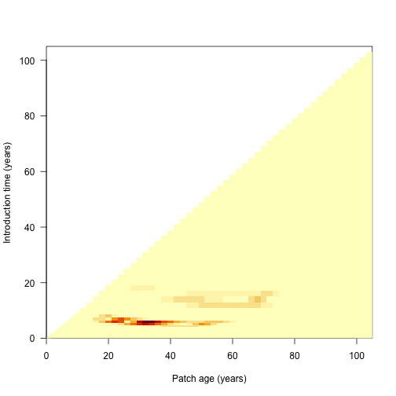

<!-- NB:
 This file is generated from the file `vignettes/Node_spacing.Rmd`. Make any edits there. To regenerate

setwd("vignettes")
knitr::knit("node_spacing.Rmd.orig", "node_spacing.md")
file.copy("node_spacing.md", "node_spacing.Rmd", overwrite = TRUE)
unlink("node_spacing.md")
-->"


# Background

As described in the [demography vignette](https://traitecoevo.github.io/plant/articles/demography.html#approximation-of-size-density-distribution-via-the-scm),
the spacing of nodes can affect the accuracy of integration over the
size-density distribution. `plant` uses an adaptive algorithm to build an 
appropriately spaced node schedule with the desired accuracy at every time
point, using as few nodes as possible.

The `build_schedule` function takes an
initial vector of introduction times and considers for each node
whether removing that node causes the error introduced when
integrating two specified functions over the size-density distribution to jump
over the allowable error threshold `schedule_eps`. This
calculation is repeated for every time step in the development of the
patch. A new node is introduced immediately prior to any node
failing these tests. The dynamics of the patch are
then simulated again and the process is repeated, until all integrations at
all time points have an error below the tolerable limit
`schedule_eps`. Decreasing `schedule_eps` demands higher
accuracy from the solver, and thus increases the number of nodes being
introduced. Note that we are assessing whether removing an existing node
causes the error to jump above the threshold limit, and using this to decide
whether an extra node -- in addition to the one used in the test --
should be introduced. Thus, the actual error is likely to
be lower than, but at most equal to, `schedule_eps`.

This vignette shows some details of node splitting, most of which happens
automatically. It's probably not very interesting to most people, only those
interested in knowing how the SCM technique works in detail.  It also uses a lot
of non-exported, non-documented functions from plant so you'll see
a lot of `plant:::` prefixes. 


# Node introduction times

<!-- TODO: elaborate on why concentrating concentrating early helps -->

The default node introduction times are designed to concentrate
node introductions onto earlier times, based on empirical
patterns of node refining:


```r
library(plant)
library(parallel)
ncores <- detectCores() - 1

p0 <- scm_base_parameters("FF16")
p <- expand_parameters(trait_matrix(0.0825, "lma"), p0, birth_rate_list = 20)

times_default <- p$node_schedule_times[[1]]
plot(times_default, cex=.2, pch=19, ylab="Time (years)", las=1)
```


<!-- TODO: explain how introducing two species together reduces work -->

The actual differences are stepped in order to increase the chance
that nodes from different species will be introduced at the same
time and reduce the total amount of work being done.


```r
plot(diff(times_default), pch=19, cex=.2, ylab="Time difference (years)", las=1)
```


# Estimating error in node spacing


We can assess the impact of node spacing on integration error by examining
the cumulative offspring production of a patch.

Increasing the number of nodes is expected to increase integration accuracy
at the expense of more computational effort. We can create more refined schedules
by interleaving points into the existing schedule:


```r
interleave <- function(x) {
  n <- length(x)
  xp <- c(x[-n] + diff(x) / 2, NA)
  c(rbind(x, xp))[- 2 * n]
}


times_2x <- interleave(times_default)
times_4x <- interleave(times_2x)

plot(times_default, xlab = "Node #", ylab="Time (years)",
     xlim = c(1, length(times_8x)), las=1, pch = 19, cex=.2,)
points(times_2x, pch=19, cex=.2, las=1, col = "blue")
points(times_4x, pch=19, cex=.2, las=1, col = "red")
```


Each schedule runs for the same duration, but `times_high` has 4x as many nodes.
Running a patch with each node schedule allows us to compare the propagule
outputs:


```r
run_with_times <- function(p, t) {
  p$node_schedule_times[[1]] <- t
  
  start <- Sys.time()
  offspring_production <- run_scm(p)$offspring_production
  print(paste("Time to solve:", round(Sys.time() - start, 2)))
  
  return(offspring_production)
}

offspring_production_default <- run_with_times(p, times_default)
```

```
## [1] "Time to solve: 0.68"
```

```r
offspring_production_2x <- run_with_times(p, times_2x)
```

```
## [1] "Time to solve: 1.36"
```

```r
offspring_production_4x <- run_with_times(p, times_4x)
```

```
## [1] "Time to solve: 4.35"
```

```r
node_range <- c(length(times_default), length(times_2x),
                  length(times_4x))
offspring_production_range <- c(offspring_production_default, offspring_production_2x, 
                     offspring_production_4x)
```
Quadrupling the number of nodes results in nearly a 6x increase in runtime,
eight times the nodes takes roughly 26x longer (the latter not shown).


```r
plot(x = node_range, y = offspring_production_range,
     xlab="Number of node introductions", ylab="Offspring production", las=1)
```


Offspring production increases as nodes are introduced more finely,
though at a saturating rate, meaning there are diminishing returns in accuracy
for additional nodes.


The differences in sffspring production are not actually that striking
(perhaps 
1%) but 
the introduced  *variation* creates instabilities of sufficient concern.

# Individual Offspring production contributions

Where is the fitness difference driving change in Offspring production coming from? 

Consider adding a *single* additional node at one of the points
along the first vector of times `times_default` and computing the 
output Offspring production:


```r
insert_time <- function(i, x) {
  j <- seq_len(i)
  c(x[j], (x[i] + x[i+1])/2, x[-j])
}
run_with_insert <- function(i, p, t) {
  run_with_times(p, insert_time(i, t))
}

insert_positions <- seq_len(length(times_default) - 1)
offspring_productions <- unlist(mclapply(insert_positions, run_with_insert, 
                              p, times_default, mc.cores = ncores))

offspring_production_differences <- offspring_productions - offspring_production_default

plot(insert_positions, offspring_production_differences, 
     xlab="Node #", ylab="Difference from default Offspring production", las=1)
abline(h=0, col="grey")
```


The biggest deviations in output Offspring production come about half way
through the schedule, though because of the compression of early times 
this occurs fairly early in patch development:


```r
times_interpolated <- (times_default[-1L] + 
                         times_default[-length(times_default)]) / 2

plot(times_interpolated, offspring_production_differences,
     xlab="Time (years)", ylab="Difference from default Offspring production", las=1)
abline(h=0, col="grey")
```


Now look at the contribution of different nodes to the overall patch output
(log scaled for clarity):

Todo: This code and thes rest of this sectiuon is broken, need to fix


```r
default <- run_scm(p)

# remove first node to avoid log(0)
plot(times_default[-1], default$offspring_production_node(1)[-1], log = "y",
     xlab="Time (years)", ylab="Offspring production (log scale)")

top_5 <- order(abs(offspring_production_differences), decreasing=TRUE)[1:5]
abline(v=times_interpolated[top_5], col=c("red", rep("grey", 4)))
```
<!-- TODO: there might be a clearer way to summarise this point -->

In this case almost all the contribution comes from early nodes
(this is essentially a single-age stand of pioneers).  

Overlaid on this are the five nodes where extra refinement
(i.e. inserting an additional node) causes the largest
change in overall Offspring production output (biggest difference in red).  

The difference is not coming from Offspring production contributions of those
nodes, which is basically zero, though it is higher than the
surrounding nodes.


# Individual competitive impacts

If the inserted nodes are not altering Offspring production through individual
contributions, they may be altering the output of neighbouring nodes
through comepttive interactions.

Here we investigate the differences in patch light environment after
introducing the single node driving the greatest difference in seed output
identified above.

First we run patches with and without the extra node, collecting the complete
set of patch conditions at each timestep.


```r
collect_with_times <- function(p, t) {
  p$node_schedule_times[[1]] <- t
  result <- run_scm_collect(p)
  return(result)
}

insert_position <- top_5[1]
times_insert <- insert_time(insert_position, times_default)

results_default <- collect_with_times(p, times_default)
results_insert <- collect_with_times(p, times_insert)
```
In order to make a direct comparison, we need to interpolate the light
environment over a common set of heights at each time step.

We reconstruct the light environment spline for both runs, and compute light_availability in both:


```r
interpolated_light_availability <- function(env, heights) {
  # intialise new spline with existing values
  spline <- plant:::Interpolator()
  spline$init(env[, 1], env[, 2])
  
  # subset to valid heights in patch
  patch_heights <- heights < spline$max
  
  # evaluate over list of heights and zero
  y <- spline$eval(heights)
  y[!patch_heights] = 0
  
  return(y)
} 

n = length(results_default$time)

max_height <- max(results_default$env[[n]][, 1],
                  results_insert$env[[n+1]][, 1])

heights <- seq(0, max_height, length.out=201)
light_availability_spline_default <- sapply(results_default$env, interpolated_light_availability, heights)
light_availability_spline_insert <- sapply(results_insert$env, interpolated_light_availability, heights)

light_availability_spline_difference <- t(light_availability_spline_insert[, -(insert_position + 1)] - canopy_default)
light_availability_spline_difference[abs(light_availability_spline_difference) < 1e-10] <- NA
```

Taking the difference between light environments at each height and timestep,
the resulting image plot is blue in regions where the refined light environment,
with the additional node is lighter (higher light_availability)
and red in regions where the the light environment is darker with the additional
node.


```r
# ColorBrewer's RdBu palette
cols <- c("#B2182B", "#D6604D", "#F4A582", "#FDDBC7",
          "#D1E5F0", "#92C5DE", "#4393C3", "#2166AC")
pal <- colorRampPalette(cols)(20)

image(results_default$time, heights, light_availability_spline_difference,
      xlab="Time (years)", ylab="Height (m)", las=1, col=pal)
```
Shading is lower for ~7 m tall nodes at year 25. This increased competitive intensity
may be driving differences in Offspring production.

# Monitoring integration accuracy

<!-- TODO: find more general terms for 'area_leaf_error' -->

The internal function `plant:::run_scm_error` runs the SCM and
computes errors as the integration proceeds. 

We integrate two different functions over the size-density distribution,
`area_leaf_error` and `offspring_production_error`, and assess how much removing the focal
node increases the error in these two integrations.

`area_leaf_error`, determines how much the removal of the focal node
increases the error in the estimate of the total leaf area in the patch. 

Similarly, `offspring_production_error`, determines how much the removal of the focal node
increases the error in the estimate of the total seed
production from the patch. The relative error in each integration is then
calculated using the `local_error_integration` function.

We've shown that large differences  manifest in light_availability.
Here we use `plant:::run_scm_error` to assess the integration error of
the leaf area for all nodes.

The black line indicates the node identified as problematic above.


```r
patch_error <- plant:::run_scm_error(p)
image(times_default, times_default, patch_error$err$lai[[1]],
      xlab="Patch age (years)", ylab="Introduction time (years)", las=1)
```



```r
#abline(h=times_default[top_5[1]])
```

`plant:::run_scm_error` is used by the `build_schedule` function to find
an appropriately refined node spacing algorithm that minimises both
integration errors. 


```r
p_refined <- build_schedule(p)
offspring_production_refined <- attr(p_refined, "offspring_production")
```

We can see the impact of this refinement by repeating our earlier analysis
and inserting a new node at each timestep and extracting the Offspring production:


```r
times_refined <- p_refined$node_schedule_times[[1]]

insert_positions <- seq_len(length(times_refined) - 1)

offspring_productions_refined <- unlist(mclapply(insert_positions, run_with_insert, 
                                      p_refined, times_refined, 
                                      mc.cores = n_cores))

refined_differences = offspring_productions_refined - offspring_production_refined

plot(insert_positions, refined_differences, 
     xlab="Index", ylab="Offspring production differences", las=1)
abline(h=0, col="grey")
```


Some nodes still introduce variation, however errors in Offspring production are reduced
by an order of magnitude, and are even smaller if considering relative error:


```r
plot(insert_positions, offspring_productions_refined / offspring_production_refined - 1, 
     xlab="Index", ylab="Relative Offspring production differences", las=1)
```


The refined node introduction schedule results in a Offspring production near the
saturating value identified in [# Offspring production] but with 210
nodes rather than the 1121 nodes used in naive interpolation.
